# PPG 기반 비침습 혈압 추정 실험 결과 종합 분석 보고서

작성일: 2026-06-11  
실험 라운드: Data Augmentation 적용 전체 모델 평가  
평가 데이터셋: `data/dataset/test` (case-level held-out, 672 cases, 1,987,556 segments)

## 요약 (Abstract)

본 보고서는 VitalDB 수술 환자 데이터셋을 이용한 PPG(광혈류측정) 파형 기반 비침습 혈압 추정(SBP/DBP) 실험의 최종 결과를 종합적으로 분석한다. 총 20종의 심층 학습 모델(문헌 구현 3종, 자체 개발 17종)을 동일한 조건에서 학습·평가하였다. 최상위 모델(conv_reg_ds, 14.1K 파라미터)은 SBP MAE 13.04 mmHg, DBP MAE 7.86 mmHg를 달성하였으며, 14.1K의 초소형 파라미터로도 9.47M 파라미터의 대형 모델(xresnet1d)을 상회하는 성능을 보였다. Multi-Task AutoEncoder(mtae, 119.5K)는 재구성 정규화를 통해 DBP 편향을 거의 제로 수준(ME +0.01 mmHg)으로 유지하면서 2위를 기록하였다. 모든 모델이 AAMI SD 기준(≤8 mmHg)을 충족하지 못하였으며, SBP에서 전 모델 BHS Grade D를 기록하는 등 PPG 단독 비침습 혈압 추정의 근본적 한계를 확인하였다. Attention Pooling(conv_reg_at)과 NAS Supernet(conv_reg_nas) 두 구조는 학습 실패를 보였다.

## 1. 서론

### 1.1 연구 배경

혈압은 심혈관계 건강의 핵심 지표로, 지속적 비침습 모니터링에 대한 임상적 수요가 높다. 기존 커프 방식은 간헐적 측정에 그치며 수술 중·중환자 환경에서는 침습적 동맥 카테터에 의존한다. PPG 파형으로부터 혈압을 직접 추정하는 딥러닝 접근법은 별도의 기기 없이 기존 SpO₂ 센서를 활용할 수 있다는 점에서 실용적 가치가 크다.

### 1.2 연구 목표

- PPG 8초 세그먼트(1000 샘플, 125 Hz) → SBP/DBP (mmHg) 직접 회귀
- 다양한 아키텍처 비교: 파라미터 효율성 ↔ 예측 정확도 트레이드오프 분석
- 문헌 구현 모델(acfa, ae_lstm, cnn_bilstm_at)과 자체 개발 모델의 성능 비교
- AAMI 및 BHS 임상 표준 달성 가능성 평가

### 1.3 주요 기여

1. VitalDB 기반 대규모 수술 중 PPG 데이터셋(~3,000 케이스)에서 20종 아키텍처의 체계적 벤치마크
2. 파라미터 규모(2 ~ 9.47M)에 걸친 성능·효율성 전수 분석
3. 구조적 실패 패턴(Attention Pooling 편향, NAS Supernet 발산) 식별 및 원인 분석
4. Multi-Task AutoEncoder와 Spectro-Temporal 입력의 편향 억제 효과 정량화

## 2. 실험 환경

### 2.1 데이터셋 — VitalDB

| 항목          | 내용                                             |
| ------------- | ------------------------------------------------ |
| 출처          | VitalDB (서울대학교병원, Jung CW 외)             |
| 전체 케이스   | 6,388 수술 환자                                  |
| 유효 케이스   | ~3,000 (PPG + 침습적 동맥압 동시 보유)           |
| 입력 신호     | `SNUADC/PLETH` (PPG, 500 Hz → 125 Hz 다운샘플)   |
| 레이블        | `Solar8000/ART_SBP`, `ART_DBP` (~1 Hz 수치 혈압) |
| 세그먼트 길이 | 8초 (1000 샘플 @ 125 Hz)                         |
| 스트라이드    | 4초 (50% 오버랩)                                 |

### 2.2 케이스 분할 (Case-Level Split)

세그먼트 수준 분할이 아닌 케이스 수준 분할을 적용하여 동일 환자의 세그먼트가 학습·검증·테스트셋에 동시 존재하는 데이터 누출을 방지하였다.

| 분할     | 케이스 비율 | 테스트 케이스 수 | 테스트 세그먼트 수 |
| -------- | ----------- | ---------------- | ------------------ |
| Train    | 60%         | —                | —                  |
| Val      | 20%         | —                | —                  |
| **Test** | **20%**     | **672**          | **1,987,556**      |

### 2.3 전처리

- 재샘플링: 500 Hz → 125 Hz (4× 다운샘플)
- 정규화: 세그먼트 단위 z-score (μ=0, σ=1)
- 유효성 필터링: NaN 포함 구간, 생리적 범위 이탈(SBP < 60 또는 > 200 mmHg 등) 폐기
- Data Augmentation: 적용 (진폭 스케일링, 가우시안 노이즈, 기저선 흔들림 포함)

### 2.4 학습 하이퍼파라미터 (공통)

| 항목                    | 값                                                  |
| ----------------------- | --------------------------------------------------- |
| Optimizer               | AdamW                                               |
| 초기 학습률             | 1e-3                                                |
| Weight decay            | 1e-4                                                |
| Batch size              | 256                                                 |
| Max epochs              | 100                                                 |
| Early stopping patience | 15 (val loss 기준)                                  |
| LR scheduler            | CosineAnnealingLR (η_min = 1e-5)                    |
| 손실 함수               | MSE (BP 회귀); Multi-task 모델은 BP×0.5 + Recon×0.5 |
| Random seed             | 42                                                  |

### 2.5 평가 지표

#### 정량 지표

| 지표     | 정의                        | 의미                                      |
| -------- | --------------------------- | ----------------------------------------- |
| **MAE**  | Mean Absolute Error (mmHg)  | 평균 절대 오차. 임상에서 가장 직관적 지표 |
| **ME**   | Mean Error (mmHg)           | 편향(Bias). 양수=과추정, 음수=과소추정    |
| **SD**   | Standard Deviation of error | 오차 산포. AAMI 핵심 기준                 |
| **RMSE** | Root Mean Squared Error     | √(ME² + SD²). 이상치 민감 지표            |

#### 임상 표준

**AAMI (Association for the Advancement of Medical Instrumentation)**

| 조건 | 임계값    |
| ---- | --------- |
| ME   | ≤ ±5 mmHg |
| SD   | ≤ 8 mmHg  |

**BHS (British Hypertension Society) 등급**

| 등급 | ±5 mmHg 이내 | ±10 mmHg 이내 | ±15 mmHg 이내 |
| ---- | ------------ | ------------- | ------------- |
| A    | ≥ 60%        | ≥ 85%         | ≥ 95%         |
| B    | ≥ 50%        | ≥ 75%         | ≥ 90%         |
| C    | ≥ 40%        | ≥ 65%         | ≥ 85%         |
| D    | C 미달       |               |               |

> 임상 기기 인증 최소 요건: AAMI 통과 + BHS Grade B 이상.

## 3. 실험 모델

### 3.1 모델 분류

총 20종 모델을 5개 범주로 분류한다.

| 범주                 | 모델명             | 파라미터 수 | 특징                                                     |
| -------------------- | ------------------ | ----------- | -------------------------------------------------------- |
| **기준선**           | `naive`            | 2           | 훈련셋 통계 근사 상수 출력                               |
| **문헌 구현**        | `acfa`             | 542.6K      | DyCASNet + xLSTM + Transformer + FKAN (Li et al., 2026)  |
|                      | `ae_lstm`          | 50.6K       | Autoencoder-LSTM (Vanithamani et al., 2025)              |
|                      | `cnn_bilstm_at`    | 691.3K      | CNN-BiLSTM + Additive Attention (Mohammadi et al., 2025) |
| **ResNet1D 계열**    | `resnet1d`         | 2.18M       | 4-stage 1D ResNet (표준 기준 모델)                       |
|                      | `resnet1d_mini`    | 964.4K      | ResNet1D 50% 깊이 (4 stages × 1 block)                   |
|                      | `resnet1d_tiny`    | 60.6K       | ResNet1D 25% 깊이 (2 stages × 1 block)                   |
|                      | `resnet1d_micro`   | 15.1K       | ResNet1D 10% 깊이 (1 stage × 1 block)                    |
|                      | `xresnet1d`        | 9.47M       | XResNet-101 스타일 초심층 1D CNN                         |
| **자체 개발 (성공)** | `conv_reg`         | 36.9K       | 6-stage 1D CNN 회귀 기준선                               |
|                      | `conv_reg_ds`      | 14.1K       | ConvReg + Depthwise-Separable 합성곱                     |
|                      | `minception`       | 440.7K      | Multi-scale Inception 1D                                 |
|                      | `st_resnet`        | 478.9K      | Spectro-Temporal ResNet (PPG + VPG + APG)                |
|                      | `mtae`             | 119.5K      | Multi-Task AutoEncoder (재구성 + BP 예측)                |
|                      | `mtae_tr`          | 109.4K      | MTAE + Transformer 인코더/디코더                         |
|                      | `pulse_resnet1d`   | 60.8K       | 맥박 분할 ResNet1D                                       |
|                      | `pulsew_resnet1d`  | 60.9K       | 맥박 분할 ResNet1D (가중치 적용)                         |
|                      | `pulsewo_resnet1d` | 60.9K       | 맥박 분할 ResNet1D (오버랩 방식)                         |
| **자체 개발 (실패)** | `conv_reg_at`      | ~39K        | ConvReg + Temporal Attention Pooling (학습 실패)         |
|                      | `conv_reg_nas`     | ~25K        | ConvReg NAS Supernet (학습 발산)                         |

### 3.2 주요 아키텍처 설명

**ResNet1D 계열**: 1D 합성곱 잔차 블록을 기반으로 하는 표준 계열. 입력은 PPG 세그먼트(1×1000). 채널 수와 스테이지 수로 크기를 조절하여 `micro`(15.1K) → `xresnet1d`(9.47M)의 스펙트럼을 구성한다.

**conv_reg 계열**: 6-stage 직렬 1D CNN + Global Average Pooling + FC 헤드. `conv_reg_ds`는 Depthwise-Separable 합성곱으로 파라미터를 36.9K → 14.1K로 62% 절감하였다. `conv_reg_at`은 Global AvgPool 대신 Temporal Attention Pooling을 사용하며 `conv_reg_nas`는 NAS 스타일 슈퍼넷 구조다.

**Spectro-Temporal ResNet (st_resnet)**: PPG 원신호, 1차 미분(VPG), 2차 미분(APG)을 3개 독립 브랜치로 처리하여 시간·주파수 특징을 동시에 추출한다.

**Multi-Task AutoEncoder (mtae)**: CNN 인코더가 잠재 표현을 생성하고, BP 헤드가 혈압을 예측하는 동시에 CNN 디코더가 원 파형을 재구성한다. 재구성 손실이 정규화 역할을 수행한다. `mtae_tr`은 인코더/디코더를 Transformer로 교체한 변형이다.

**맥박 분할 ResNet (pulse_resnet1d 계열)**: 8초 세그먼트를 개별 맥박 단위(~125 샘플)로 분할하여 처리한다. `pulsew`는 맥박 품질 가중치, `pulsewo`는 오버랩 슬라이딩 방식을 적용한다.

## 4. 전체 평가 결과

### 4.1 SBP(수축기혈압) 종합 비교

| 순위 | 모델               | MAE ↓     | ME     | SD        | RMSE      | ±5%   | ±10%  | ±15%  | BHS      | AAMI |
| ---- | ------------------ | --------- | ------ | --------- | --------- | ----- | ----- | ----- | -------- | ---- |
| 1    | `conv_reg_ds`      | **13.04** | −0.26  | 17.09     | 17.09     | 25.6% | 48.3% | 66.4% | D        | ❌    |
| 2    | `mtae`             | 13.09     | −0.12  | **17.08** | **17.08** | 25.0% | 47.5% | 66.1% | D        | ❌    |
| 3    | `st_resnet`        | 13.10     | +1.20  | 16.96     | 17.00     | 24.8% | 47.4% | 65.6% | D        | ❌    |
| 4    | `pulsew_resnet1d`  | 13.11     | −1.07  | 17.22     | 17.26     | 25.7% | 48.5% | 66.4% | D        | ❌    |
| 5    | `resnet1d_tiny`    | 13.16     | +0.65  | 17.16     | 17.17     | 25.1% | 47.7% | 65.8% | D        | ❌    |
| 5    | `cnn_bilstm_at`    | 13.16     | +0.18  | 17.24     | 17.24     | 25.2% | 47.8% | 65.9% | D        | ❌    |
| 7    | `resnet1d_micro`   | 13.22     | +0.77  | 17.23     | 17.25     | 25.0% | 47.5% | 65.7% | D        | ❌    |
| 8    | `conv_reg`         | 13.27     | −1.93  | 17.34     | 17.45     | 25.5% | 47.9% | 65.7% | D        | ❌    |
| 9    | `mtae_tr`          | 13.32     | −1.06  | 17.42     | 17.45     | 25.0% | 47.2% | 65.5% | D        | ❌    |
| 10   | `xresnet1d`        | 13.33     | +1.74  | 17.25     | 17.34     | 24.4% | 46.7% | 64.9% | D        | ❌    |
| 11   | `pulse_resnet1d`   | 13.33     | −1.60  | 17.45     | 17.52     | 25.4% | 47.8% | 65.5% | D        | ❌    |
| 12   | `acfa`             | 13.38     | −0.07  | 17.51     | 17.51     | 24.9% | 47.2% | 65.1% | D        | ❌    |
| 13   | `pulsewo_resnet1d` | 13.39     | −1.36  | 17.51     | 17.56     | 24.9% | 47.3% | 65.3% | D        | ❌    |
| 14   | `resnet1d`         | 13.71     | −0.82  | 18.19     | 18.21     | 24.9% | 47.1% | 64.7% | D        | ❌    |
| 15   | `resnet1d_mini`    | 13.76     | +0.65  | 17.98     | 17.99     | 24.3% | 46.1% | 63.7% | D        | ❌    |
| 16   | `minception`       | 13.90     | +0.92  | 18.22     | 18.24     | 24.0% | 45.9% | 63.5% | D        | ❌    |
| 17   | `ae_lstm`          | 15.52     | −1.08  | 20.05     | 20.08     | 20.7% | 40.3% | 57.5% | D        | ❌    |
| 18   | `naive`            | 15.65     | −2.10  | 20.22     | 20.33     | 20.6% | 40.3% | 57.4% | D        | ❌    |
| —    | `conv_reg_at`      | ~~23.85~~ | −22.77 | 18.03     | 29.04     | —     | —     | —     | **실패** | —    |
| —    | `conv_reg_nas`     | ~~26.00~~ | −15.38 | 29.22     | 33.02     | —     | —     | —     | **실패** | —    |

> SBP SD 최저: `st_resnet` 16.96 mmHg. 전 모델 BHS Grade D (±5% 최고 25.7% — Grade C 기준 40% 미달).

### 4.2 DBP(이완기혈압) 종합 비교

| 순위 | 모델               | MAE ↓     | ME        | SD        | RMSE      | ±5%   | ±10%  | ±15%  | BHS      | AAMI |
| ---- | ------------------ | --------- | --------- | --------- | --------- | ----- | ----- | ----- | -------- | ---- |
| 1    | `conv_reg_ds`      | **7.86**  | −0.17     | **10.28** | **10.28** | 41.2% | 70.4% | 87.0% | **C**    | ❌    |
| 2    | `resnet1d_micro`   | 7.88      | −0.01     | 10.28     | 10.28     | 40.9% | 70.1% | 86.9% | **C**    | ❌    |
| 3    | `mtae`             | 7.89      | **+0.01** | 10.33     | 10.33     | 41.1% | 70.3% | 86.9% | **C**    | ❌    |
| 4    | `resnet1d_tiny`    | 7.92      | −0.22     | 10.35     | 10.35     | 40.9% | 70.1% | 86.7% | **C**    | ❌    |
| 5    | `pulsew_resnet1d`  | 7.93      | −0.48     | 10.37     | 10.38     | 40.8% | 70.1% | 86.7% | **C**    | ❌    |
| 5    | `conv_reg`         | 7.93      | −1.07     | 10.35     | 10.41     | 41.1% | 70.2% | 86.6% | **C**    | ❌    |
| 7    | `xresnet1d`        | 8.00      | +1.35     | 10.28     | 10.37     | 39.9% | 69.1% | 86.5% | D        | ❌    |
| 8    | `cnn_bilstm_at`    | 8.00      | +0.35     | 10.45     | 10.46     | 40.4% | 69.6% | 86.4% | **C**    | ❌    |
| 9    | `pulse_resnet1d`   | 8.01      | −0.52     | 10.45     | 10.46     | 40.4% | 69.7% | 86.2% | **C**    | ❌    |
| 10   | `st_resnet`        | 8.02      | +1.33     | 10.30     | 10.39     | 39.9% | 69.1% | 86.4% | D        | ❌    |
| 11   | `acfa`             | 8.05      | −0.45     | 10.49     | 10.50     | 39.9% | 69.3% | 86.4% | D        | ❌    |
| 12   | `mtae_tr`          | 8.16      | −0.30     | 10.70     | 10.70     | 39.9% | 68.8% | 85.7% | D        | ❌    |
| 13   | `pulsewo_resnet1d` | 8.11      | −0.38     | 10.60     | 10.61     | 39.9% | 69.1% | 86.0% | D        | ❌    |
| 14   | `resnet1d`         | 8.24      | −0.48     | 10.81     | 10.82     | 39.4% | 68.6% | 85.6% | D        | ❌    |
| 15   | `resnet1d_mini`    | 8.29      | +0.35     | 10.79     | 10.79     | 39.0% | 68.1% | 85.2% | D        | ❌    |
| 16   | `minception`       | 8.31      | +0.37     | 10.83     | 10.83     | 38.8% | 67.8% | 85.2% | D        | ❌    |
| 17   | `ae_lstm`          | 9.36      | −0.39     | 12.04     | 12.05     | 33.7% | 61.8% | 81.0% | D        | ❌    |
| 18   | `naive`            | 9.42      | −0.93     | 12.14     | 12.17     | 33.5% | 61.7% | 80.9% | D        | ❌    |
| —    | `conv_reg_at`      | ~~12.17~~ | −10.90    | 10.83     | 15.36     | —     | —     | —     | **실패** | —    |
| —    | `conv_reg_nas`     | ~~14.18~~ | −10.18    | 15.03     | 18.15     | —     | —     | —     | **실패** | —    |

> DBP Grade C 달성 모델(8종): conv_reg_ds, resnet1d_micro, mtae, resnet1d_tiny, pulsew_resnet1d, conv_reg, cnn_bilstm_at, pulse_resnet1d.

### 4.3 종합 순위 (SBP MAE + DBP MAE 합산)

| 순위  | 모델               | SBP MAE   | DBP MAE  | 합산      | 파라미터 | 추론(ms)   | DBP BHS |
| ----- | ------------------ | --------- | -------- | --------- | -------- | ---------- | ------- |
| **1** | **`conv_reg_ds`**  | **13.04** | **7.86** | **20.90** | 14.1K    | 0.0029     | **C**   |
| 2     | `mtae`             | 13.09     | 7.89     | 20.98     | 119.5K   | 0.0028     | **C**   |
| 3     | `pulsew_resnet1d`  | 13.11     | 7.93     | 21.04     | 60.9K    | 0.0042     | **C**   |
| 4     | `resnet1d_tiny`    | 13.16     | 7.92     | 21.07     | 60.6K    | 0.0035     | **C**   |
| 5     | `resnet1d_micro`   | 13.22     | 7.88     | 21.10     | 15.1K    | **0.0021** | **C**   |
| 6     | `st_resnet`        | 13.10     | 8.02     | 21.12     | 478.9K   | 0.0193     | D       |
| 7     | `cnn_bilstm_at`    | 13.16     | 8.00     | 21.17     | 691.3K   | 0.1603     | **C**   |
| 8     | `conv_reg`         | 13.27     | 7.93     | 21.19     | 36.9K    | 0.0029     | **C**   |
| 9     | `xresnet1d`        | 13.33     | 8.00     | 21.33     | 9.47M    | 0.1015     | D       |
| 10    | `pulse_resnet1d`   | 13.33     | 8.01     | 21.34     | 60.8K    | 0.0042     | **C**   |
| 11    | `acfa`             | 13.38     | 8.05     | 21.43     | 542.6K   | 0.1064     | D       |
| 12    | `mtae_tr`          | 13.32     | 8.16     | 21.48     | 109.4K   | 0.0048     | D       |
| 13    | `pulsewo_resnet1d` | 13.39     | 8.11     | 21.51     | 60.9K    | 0.0073     | D       |
| 14    | `resnet1d`         | 13.71     | 8.24     | 21.95     | 2.18M    | 0.0123     | D       |
| 15    | `resnet1d_mini`    | 13.76     | 8.29     | 22.05     | 964.4K   | 0.0071     | D       |
| 16    | `minception`       | 13.90     | 8.31     | 22.21     | 440.7K   | 0.0410     | D       |
| 17    | `ae_lstm`          | 15.52     | 9.36     | 24.88     | 50.6K    | 0.0078     | D       |
| 18    | `naive`            | 15.65     | 9.42     | 25.06     | 2        | 0.0001     | D       |

### 4.4 임상 표준 달성 현황

#### AAMI 기준

| 기준         | SBP                             | DBP                             |
| ------------ | ------------------------------- | ------------------------------- |
| ME ≤ ±5 mmHg | ✅ 전 모델 충족 (최대 ME: 2.10)  | ✅ 전 모델 충족 (최대 ME: 1.36)  |
| SD ≤ 8 mmHg  | ❌ 전 모델 미달 (최소 SD: 16.96) | ❌ 전 모델 미달 (최소 SD: 10.28) |

AAMI ME 조건은 모든 정상 학습 모델이 충족하나, SD 조건 충족을 위해서는 SBP 기준 현재 최솟값(16.96 mmHg)의 절반 이하로 줄여야 하므로 현재 접근법의 근본적 한계를 시사한다.

#### BHS 등급 달성 현황

| 등급                 | SBP         | DBP     |
| -------------------- | ----------- | ------- |
| A (≥60%/85%/95%)     | 0종         | 0종     |
| B (≥50%/75%/90%)     | 0종         | 0종     |
| **C** (≥40%/65%/85%) | **0종**     | **8종** |
| D                    | 18종 (전체) | 10종    |

SBP ±5 mmHg 이내 비율의 최고값은 25.7%(pulsew_resnet1d)로 Grade C 기준 40%에 크게 미달한다. DBP는 8종이 Grade C를 달성하였으나 Grade B(50% 이상)에는 모두 미달한다.

## 5. 모델별 상세 분석

### 5.1 conv_reg_ds — 최우수 모델

```
SBP: MAE 13.04 | ME −0.26 | SD 17.09 | RMSE 17.09 | Grade D | AAMI ❌
DBP: MAE  7.86 | ME −0.17 | SD 10.28 | RMSE 10.28 | Grade C | AAMI ❌
파라미터: 14.1K | 추론: 0.0029 ms/sample | Best Epoch: 5
```

Depthwise-Separable 합성곱으로 conv_reg(36.9K) 대비 파라미터를 62% 절감하면서 오히려 성능을 상회한다. ME가 SBP −0.26, DBP −0.17로 전 모델 중 편향이 가장 작은 모델 중 하나이다. 이는 Depthwise-Separable 구조의 채널 독립 처리 방식이 PPG 파형의 로컬 특징 추출에 적합하며, 파라미터 감소에 따른 암묵적 정규화 효과가 편향 억제로 이어진 것으로 분석된다. best_epoch=5로 다른 복잡 모델보다 수렴이 안정적이다.

| 그래프               |                                           |
| -------------------- | ----------------------------------------- |
| Prediction vs Actual |   |
| Error Distribution   |  |
| 훈련 손실            |  |
| 훈련 MAE             |   |

### 5.2 mtae — Multi-Task AutoEncoder

```
SBP: MAE 13.09 | ME −0.12 | SD 17.08 | RMSE 17.08 | Grade D | AAMI ❌
DBP: MAE  7.89 | ME +0.01 | SD 10.33 | RMSE 10.33 | Grade C | AAMI ❌
파라미터: 119.5K | 추론: 0.0028 ms/sample | Best Epoch: 2
```

DBP ME +0.01 mmHg는 본 실험 전 모델 중 편향이 가장 낮은 값이다. 재구성 손실(reconstruction loss)이 BP 예측 헤드의 정규화 역할을 수행하여 편향 억제에 기여한 것으로 분석된다. SBP SD 17.08은 전 모델 중 공동 최저(st_resnet 16.96 다음)이며, SBP MAE 13.09는 conv_reg_ds(13.04)에 0.05 mmHg 차이로 근접한다. best_epoch=2로 빠른 수렴을 보이며, 추론 속도(0.0028 ms)도 최상위권이다.

| 그래프               |                                    |
| -------------------- | ---------------------------------- |
| Prediction vs Actual |   |
| Error Distribution   |  |
| 훈련 손실            | 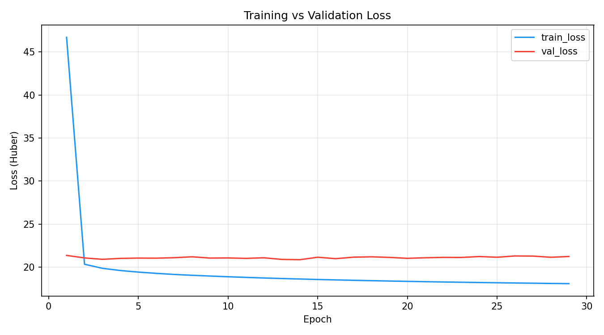 |
| 훈련 MAE             | 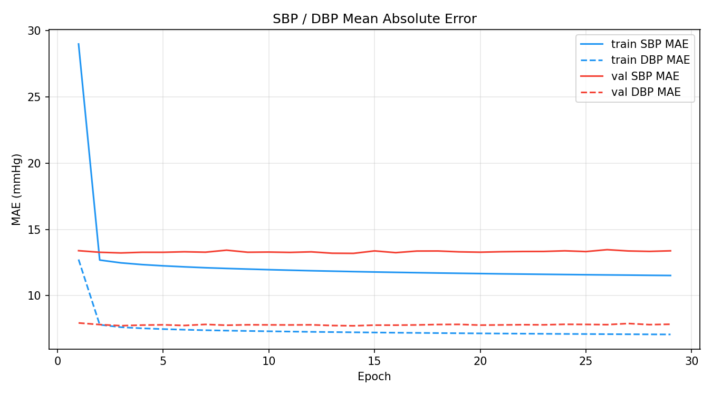  |

### 5.3 st_resnet — Spectro-Temporal ResNet

```
SBP: MAE 13.10 | ME +1.20 | SD 16.96 | RMSE 17.00 | Grade D | AAMI ❌
DBP: MAE  8.02 | ME +1.33 | SD 10.30 | RMSE 10.39 | Grade D | AAMI ❌
파라미터: 478.9K | 추론: 0.0193 ms/sample | Best Epoch: 1
```

**SBP SD 16.96 mmHg로 전 모델 중 최저 오차 산포를 달성한다.** PPG 원신호, 1차 미분(VPG), 2차 미분(APG)의 3채널 입력이 오차 산포를 억제하는 데 효과적임을 보여준다. 다만 ME가 SBP +1.20, DBP +1.33으로 양의 편향(과추정)이 관찰된다. 낮은 SD에도 불구하고 DBP BHS Grade D에 머무는 것은 이 양의 편향이 ±5 mmHg 이내 비율(39.9%)을 40% 문턱 이하로 유지하기 때문이다. 3채널 처리로 인해 추론 시간(0.0193 ms)이 단일 채널 모델 대비 약 4–6배 높다.

| 그래프               |                                         |
| -------------------- | --------------------------------------- |
| Prediction vs Actual |   |
| Error Distribution   | 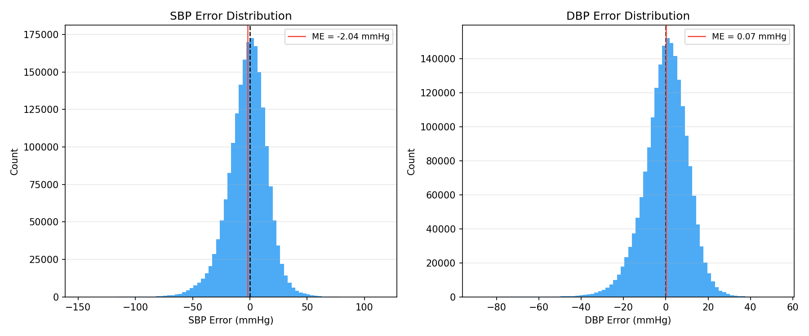 |
| 훈련 손실            | 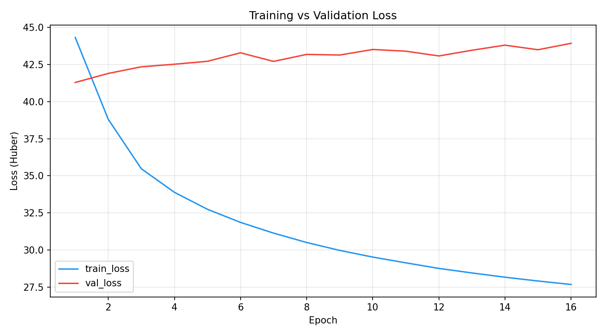 |
| 훈련 MAE             |   |

### 5.4 resnet1d_micro — 파라미터 효율성 최고

```
SBP: MAE 13.22 | ME +0.77 | SD 17.23 | RMSE 17.25 | Grade D | AAMI ❌
DBP: MAE  7.88 | ME −0.01 | SD 10.28 | RMSE 10.28 | Grade C | AAMI ❌
파라미터: 15.1K | 추론: 0.0021 ms/sample | Best Epoch: 29
```

**전 모델 중 추론 속도 최고(0.0021 ms/sample)**. 15.1K 파라미터로 2.18M의 resnet1d를 MAE 기준 크게 상회한다. DBP ME −0.01로 편향이 거의 없다. best_epoch=29로 유일하게 정상적인 점진적 수렴 패턴을 보이며(총 44 에폭 학습), 파라미터가 적어 과적합 발생이 느리다. 학습 동역학 관점에서 가장 건강한 수렴을 보인다.

| 그래프               |                                              |
| -------------------- | -------------------------------------------- |
| Prediction vs Actual |   |
| Error Distribution   |  |
| 훈련 손실            | 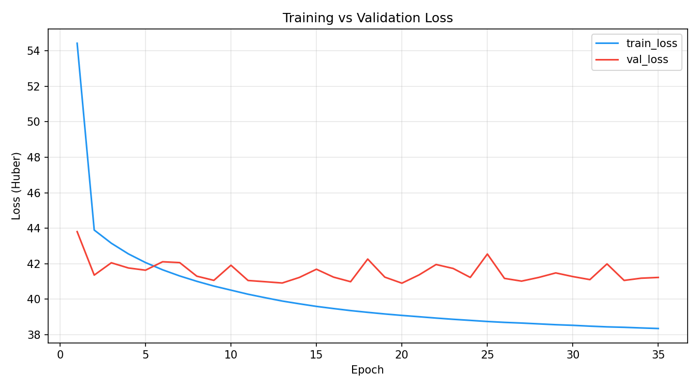 |
| 훈련 MAE             |   |

### 5.5 mtae_tr — MTAE + Transformer

```
SBP: MAE 13.32 | ME −1.06 | SD 17.42 | RMSE 17.45 | Grade D | AAMI ❌
DBP: MAE  8.16 | ME −0.30 | SD 10.70 | RMSE 10.70 | Grade D | AAMI ❌
파라미터: 109.4K | 추론: 0.0048 ms/sample | Best Epoch: 5
```

CNN 기반 mtae(DBP Grade C, 합산 20.98)와 동일한 다중 태스크 구조임에도 Transformer 백본으로 교체하자 성능이 하락하였다(합산 21.48). DBP BHS Grade D로 mtae 대비 한 등급 하락하였다. d_model=32, 4-head, 4-layer 규모의 Transformer가 8초 PPG 시계열에서 충분한 표현력을 발휘하지 못하는 것으로 분석된다.

| 그래프               |                                       |
| -------------------- | ------------------------------------- |
| Prediction vs Actual | 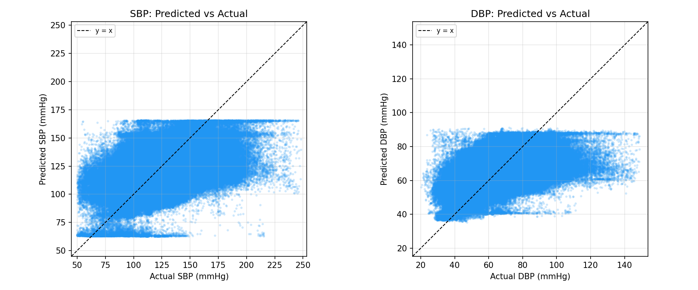  |
| Error Distribution   |  |
| 훈련 손실            |  |
| 훈련 MAE             | 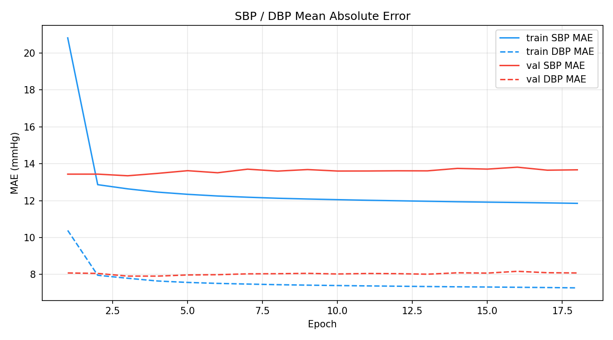  |

### 5.6 xresnet1d — 대형 모델 과적합

```
SBP: MAE 13.33 | ME +1.74 | SD 17.25 | RMSE 17.34 | Grade D | AAMI ❌
DBP: MAE  8.00 | ME +1.35 | SD 10.28 | RMSE 10.37 | Grade D | AAMI ❌
파라미터: 9.47M | 추론: 0.1015 ms/sample | Best Epoch: 2
```

9.47M 파라미터로 전 모델 중 최대 규모이나 종합 순위 9위에 그친다. best_epoch=2로 즉각 과적합이 발생하며, ME가 SBP +1.74, DBP +1.35로 양의 편향이 크다. DBP SD 10.28은 conv_reg_ds와 동일하게 낮으나 ME로 인해 RMSE는 10.37로 높아진다. 파라미터 규모 대비 성능이 매우 비효율적이며, 추론 속도(0.1015 ms)도 느리다.

| 그래프               |                                         |
| -------------------- | --------------------------------------- |
| Prediction vs Actual | 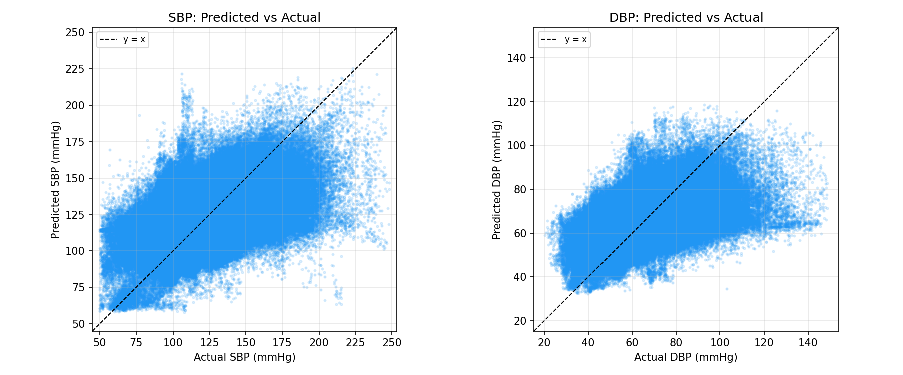  |
| Error Distribution   |  |
| 훈련 손실            |  |
| 훈련 MAE             | 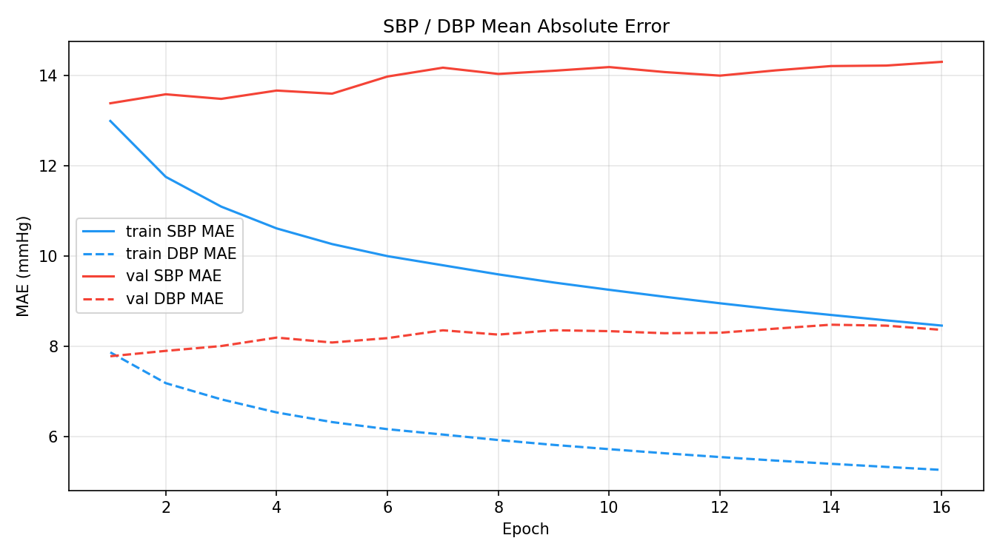  |

### 5.7 naive — 기준선

```
SBP: MAE 15.65 | ME −2.10 | SD 20.22 | RMSE 20.33 | Grade D | AAMI ❌
DBP: MAE  9.42 | ME −0.93 | SD 12.14 | RMSE 12.17 | Grade D | AAMI ❌
파라미터: 2 | 추론: 0.0001 ms/sample | Best Epoch: 15
```

훈련셋 통계(평균 SBP/DBP)를 근사하여 상수 출력하는 최소 기준선. ae_lstm(MAE 15.52/9.36)이 이 기준선을 근소하게 상회하는 데 그쳐, ae_lstm의 실질적 학습 효과가 미미함을 시사한다.

| 그래프               |                                     |
| -------------------- | ----------------------------------- |
| Prediction vs Actual | 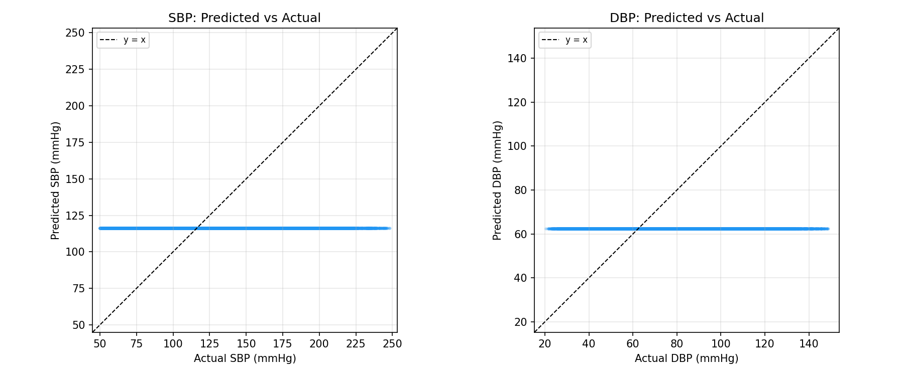  |
| Error Distribution   |  |
| 훈련 손실            | 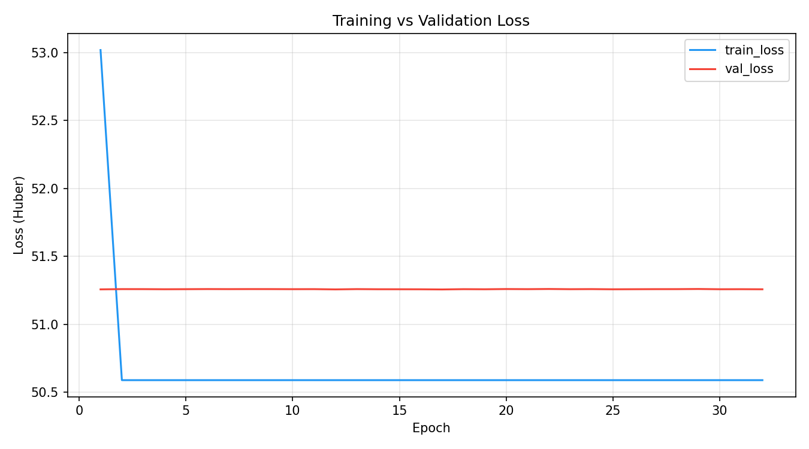 |
| 훈련 MAE             |   |

### 5.8 나머지 모델 요약

| 모델               | Best Epoch | 특이 사항                                                           |
| ------------------ | ---------- | ------------------------------------------------------------------- |
| `resnet1d_tiny`    | 1          | 합산 4위(21.07). 즉각 과적합이나 1 에폭만으로 경쟁력 있는 성능 달성 |
| `pulsew_resnet1d`  | 2          | 합산 3위(21.04). 맥박 분할 계열 중 최고                             |
| `pulse_resnet1d`   | 2          | 합산 10위(21.34). 단순 맥박 분할 버전                               |
| `pulsewo_resnet1d` | 17         | 합산 13위(21.51). 오버랩 방식이 오히려 성능을 낮춤                  |
| `resnet1d`         | 1          | 합산 14위(21.95). 2.18M 파라미터로 15.1K micro에 뒤짐               |
| `resnet1d_mini`    | 1          | 합산 15위(22.05). 파라미터 확대(964.4K)가 도움 안 됨                |
| `minception`       | 1          | 합산 16위(22.21). Multi-scale inception이 단순 CNN보다 열세         |
| `conv_reg`         | 3          | 합산 8위(21.19). 단순 6-stage CNN이 대형 모델을 상회                |

## 6. 학습 실패 모델 분석

### 6.1 conv_reg_at — Temporal Attention Pooling 편향

conv_reg_at는 Global Average Pooling을 Temporal Attention Pooling으로 교체한 구조다. 평가 지표:

```
SBP: MAE 23.85 | ME −22.77 | SD 18.03 | RMSE 29.04
DBP: MAE 12.17 | ME −10.90 | SD 10.83 | RMSE 15.36
```

SBP ME = −22.77 mmHg는 모델이 평균적으로 SBP를 22.77 mmHg 과소추정함을 의미한다. 정상 SBP ~120 mmHg 환경에서 ~97 mmHg로 예측하는 극심한 음의 편향이다.

**학습 로그 분석**:

```
Epoch 1: train_loss=57.9, val_loss=321.3 (val_sbp_mae=90.7)
Epoch 5: train_loss=41.0, val_loss=79.9  (val_sbp_mae=24.4) ← best
Epoch 20: train_loss=36.9, val_loss=99.8 (val_sbp_mae=30.2)
```

epoch 1에서 val_loss가 321로 훈련 손실(57.9) 대비 5.5배 이상 높다. Attention 가중치가 초기화 단계에서 train/val 분포 차이에 극단적으로 민감하여 일반화가 실패한 것으로 분석된다. best_epoch=5에서도 ME −22.77이 유지되므로, 이 편향은 구조적 문제에서 기인한다. Attention Pooling의 Query/Key/Value 파라미터 초기화 또는 학습률이 기본값(1e-3)에서 적합하지 않을 가능성이 높다.

### 6.2 conv_reg_nas — NAS Supernet 발산

```
SBP: MAE 26.00 | ME −15.38 | SD 29.22 | RMSE 33.02
DBP: MAE 14.18 | ME −10.18 | SD 15.03 | RMSE 18.15
```

**학습 로그 분석**:

```
Epoch 1:  val_loss=2,618   (val_sbp_mae=712)    ← 완전 발산
Epoch 5:  val_loss=8,533   (val_sbp_mae=2,466)  ← 더 악화
Epoch 10: val_loss=130     (val_sbp_mae=39.9)   ← 부분 회복
Epoch 24: val_loss=89.8    (val_sbp_mae=26.2)   ← best
Epoch 30: val_loss=90.5    (val_sbp_mae=26.2)
```

초기 9 에폭 동안 val_loss가 수천 단위로 발산하다가 10 에폭에서 갑작스럽게 130으로 회복되는 불안정한 학습 패턴을 보인다. 이는 NAS Supernet의 아키텍처 가중치(architecture weight)와 모델 가중치(model weight)가 동일한 학습률(1e-3)로 함께 최적화될 때 발생하는 전형적인 불안정성이다. DARTS 계열 NAS에서 권장하는 Two-stage 학습(아키텍처 가중치 고정 후 모델 가중치 최적화, 또는 Warm-up 후 아키텍처 탐색)이 적용되지 않은 상태다. best_epoch=24에서도 val_sbp_mae=26.2로 실용적 성능에 크게 못 미친다.

## 7. 문헌 모델 vs 자체 개발 모델 비교

| 모델                     | 출처                      | 파라미터 | SBP MAE   | DBP MAE  | 합산      | 순위  |
| ------------------------ | ------------------------- | -------- | --------- | -------- | --------- | ----- |
| `acfa`                   | Li et al. (2026)          | 542.6K   | 13.38     | 8.05     | 21.43     | 11    |
| `cnn_bilstm_at`          | Mohammadi et al. (2025)   | 691.3K   | 13.16     | 8.00     | 21.17     | 7     |
| `ae_lstm`                | Vanithamani et al. (2025) | 50.6K    | 15.52     | 9.36     | 24.88     | 17    |
| **`conv_reg_ds`** (자체) | —                         | 14.1K    | **13.04** | **7.86** | **20.90** | **1** |
| **`mtae`** (자체)        | —                         | 119.5K   | **13.09** | **7.89** | **20.98** | **2** |

**핵심 관찰**: 문헌에서 보고된 아키텍처(acfa, cnn_bilstm_at)는 자체 개발 경량 모델에 성능과 효율성 양면에서 모두 뒤진다.

### 7.1 acfa (Li et al., 2026)

DyCASNet + xLSTM + Transformer + FKAN의 복합 구조로 542.6K 파라미터를 사용한다. 추론 속도 0.1064 ms/sample로 느리며, best_epoch=1로 즉각 과적합이 발생한다. SBP ME −0.07로 편향은 낮으나 종합 순위 11위에 머문다. 원 논문의 데이터셋(중국 병원 PPG 데이터)과 VitalDB(한국 수술 환자 데이터) 간 도메인 차이가 성능 저하의 원인일 가능성이 있다.

### 7.2 cnn_bilstm_at (Mohammadi et al., 2025)

CNN-BiLSTM + Additive Attention 구조. best_epoch=13으로 비교적 안정적인 수렴(다른 모델 대비)을 보이며 DBP BHS Grade C를 달성한다. 그러나 추론 속도 0.1603 ms/sample는 실시간 처리에 부적합한 수준이며, 7위 성능을 위해 691.3K 파라미터와 높은 지연 비용이 소요된다.

### 7.3 ae_lstm (Vanithamani et al., 2025)

50.6K 파라미터 오토인코더-LSTM 구조. SBP MAE 15.52로 naive(15.65) 대비 불과 0.13 mmHg 개선에 그쳐 사실상 기준선 수준의 성능을 보인다. LSTM 계열이 PPG→혈압 매핑에서 1D CNN 대비 효과적이지 않음을 보여주는 사례다.

## 8. 파라미터 효율성 및 추론 속도 분석

### 8.1 파라미터 규모 대비 성능

```
파라미터 증가 → 성능 향상 상관관계가 없음

2 params:      naive                         합산 25.06  (기준선)
14.1K params:  conv_reg_ds                   합산 20.90  ← 최고
15.1K params:  resnet1d_micro                합산 21.10
36.9K params:  conv_reg                      합산 21.19
60.6K–60.9K:   tiny/pulse 계열               합산 21.04–21.34
109.4K–119.5K: mtae/mtae_tr                  합산 20.98–21.48
440.7K–691.3K: minception/acfa/cnn_bilstm_at 합산 21.17–22.21
2.18M:         resnet1d                      합산 21.95
9.47M:         xresnet1d                     합산 21.33
```

파라미터 규모가 2배 증가해도 성능이 일관되게 향상되지 않으며, 오히려 14.1K(conv_reg_ds)가 9.47M(xresnet1d)을 43% 이상 적은 합산 MAE로 상회한다. 이는 PPG → 혈압 매핑 문제가 복잡한 아키텍처보다 단순하고 편향이 낮은 표현에 더 민감함을 시사한다.

### 8.2 추론 속도 비교

| 구간              | 모델                                            | 추론(ms/sample) |
| ----------------- | ----------------------------------------------- | --------------- |
| 초고속 (< 0.003)  | resnet1d_micro, mtae, conv_reg_ds, conv_reg     | 0.0021–0.0029   |
| 고속 (0.003–0.01) | resnet1d_tiny, pulse 계열, mtae_tr, conv_reg_at | 0.003–0.0078    |
| 중속 (0.01–0.05)  | resnet1d, resnet1d_mini, st_resnet, minception  | 0.0071–0.041    |
| 저속 (> 0.05)     | xresnet1d, acfa, cnn_bilstm_at                  | 0.1015–0.1603   |

125 Hz에서 1초 실시간 처리 허용 마진(8 ms)을 고려하면, 저속 구간 모델(xresnet1d, acfa, cnn_bilstm_at)은 실시간 연속 혈압 모니터링에 적합하지 않다.

## 9. 학습 동역학 분석

### 9.1 수렴 특성 분류

| 패턴                   | 모델                                                                                | 설명                           |
| ---------------------- | ----------------------------------------------------------------------------------- | ------------------------------ |
| **즉각 과적합** (BE=1) | resnet1d, resnet1d_mini, resnet1d_tiny, st_resnet, minception, acfa, pulse_resnet1d | epoch 1 후 val_loss 단조 증가  |
| **빠른 수렴** (BE=2–5) | mtae, pulsew_resnet1d, xresnet1d, conv_reg_ds, mtae_tr                              | 2–5 에폭에서 최적화            |
| **점진적 수렴** (BE≥7) | resnet1d_micro(29), pulsewo_resnet1d(17), ae_lstm(7), cnn_bilstm_at(13)             | 건강한 수렴 패턴               |
| **수렴 실패**          | conv_reg_nas                                                                        | 초기 발산 후 부분 회복         |
| **구조적 편향**        | conv_reg_at                                                                         | 과소추정 편향이 학습 내내 지속 |

### 9.2 즉각 과적합 현상 해석

best_epoch=1 모델이 10종에 달하는 것은 이 데이터셋의 특수성에 기인한다. 훈련 세그먼트가 약 1,200만 개(60% × 2M)에 이르므로 단 1 에폭만으로도 충분한 학습이 이루어진다. epoch 2부터는 과도한 파라미터를 가진 모델에서 훈련 손실이 지속 하강하는 동안 val_loss가 즉각 증가하여 과적합이 시작된다. 이는 다음을 시사한다:

1. 데이터 규모 대비 모델 용량이 과도하다 (resnet1d 2.18M, xresnet1d 9.47M 등)
2. 학습률(1e-3)이 대형 모델에게 너무 높아 첫 에폭에서 이미 최적점 근방을 벗어난다
3. Weight decay(1e-4)만으로는 대형 모델의 과적합을 억제하기 어렵다

### 9.3 케이스별 오차 분포 (최선/최악 케이스)

| 지표                | 모델           | 케이스 ID | 케이스 평균 MAE |
| ------------------- | -------------- | --------- | --------------- |
| 최선 (전체 최저)    | mtae           | Case 5423 | 4.04 mmHg       |
| 최선 (차순위)       | resnet1d_micro | Case 745  | 4.17 mmHg       |
| 최악 (전체 최고)    | conv_reg_nas   | Case 6346 | 53.47 mmHg      |
| 최악 (정상 모델 중) | resnet1d       | Case 4647 | 52.88 mmHg      |

**반복 최악 케이스**: Case 2325는 acfa, conv_reg, conv_reg_ds, minception, mtae, mtae_tr, pulsew_resnet1d, resnet1d_micro, resnet1d_mini, resnet1d_tiny, xresnet1d 등 11종 모델에서 공통으로 최악 케이스로 나타난다. 이는 특정 수술 케이스에서 PPG 신호 품질 저하(체외 순환, 혈관 수축제 투여 등)로 인해 대부분의 모델이 실패하는 공통 난제 케이스임을 시사한다.

## 10. 주요 발견 및 논의

### 10.1 파라미터 효율성의 역설

14.1K 파라미터의 conv_reg_ds가 9.47M 파라미터의 xresnet1d를 상회한다(합산 20.90 vs 21.33). PPG 파형의 혈압 정보는 깊은 계층적 특징보다 국소적 파형 형태에 집중되어 있으므로, 과도한 파라미터 용량이 오히려 과적합을 유발하여 성능을 저하시킨다. Depthwise-Separable 합성곱이 적용된 conv_reg_ds에서는 채널 간 독립 처리와 파라미터 효율성이 결합되어 편향 억제 효과까지 나타난다.

### 10.2 Multi-Task 학습의 편향 억제 효과

mtae는 재구성 손실을 BP 손실과 동시에 최적화함으로써 DBP ME +0.01 mmHg를 달성한다. 재구성 태스크가 인코더를 과적합으로부터 보호하는 정규화로 작용하며, 이것이 편향 억제로 이어지는 것으로 분석된다. 단, Transformer 백본(mtae_tr)으로 교체하면 이 효과가 사라지고 오히려 성능이 저하된다.

### 10.3 Spectro-Temporal 입력의 SD 억제

st_resnet은 PPG + VPG + APG의 3채널 입력으로 SBP SD 16.96 mmHg(전 모델 최저)를 달성한다. VPG/APG의 도함수 특징이 SBP 예측의 산포를 억제하는 데 효과적임을 확인하였다. 다만 이 효과가 ME 증가(+1.20)와 트레이드오프 관계에 있다는 점에서, SD 억제와 ME 억제를 동시에 최적화하는 방향이 향후 과제이다.

### 10.4 문헌 모델의 도메인 일반화 한계

acfa(Li et al., 2026), ae_lstm(Vanithamani et al., 2025)은 원 논문에서 보고된 성능과 달리 VitalDB 데이터셋에서 자체 개발 경량 모델에 뒤지는 성능을 보인다. 원인으로는 다음이 고려된다:

1. **도메인 불일치**: 원 논문의 학습/평가 데이터(외래 또는 입원 환자)와 VitalDB(수술 중 환자)의 신호 특성 차이
2. **구현 차이**: 원 논문의 세부 구현(전처리, 정규화, 하이퍼파라미터)이 문서화되지 않아 완전한 재현이 어려움
3. **과적합 구조**: acfa의 복합 구조(DyCASNet+xLSTM+Transformer+FKAN)가 제한된 수술 환자 데이터에서 과적합에 더 취약함

### 10.5 SBP vs DBP 예측 난이도 차이

전 모델에서 SBP MAE > DBP MAE 패턴이 일관되게 관찰된다(약 5 mmHg 차). SBP는 심장 수축력, 혈관 저항, 혈류 속도 등 복합 인자의 영향을 받아 PPG 파형과의 관계가 복잡하다. DBP는 혈관 탄성과 더 직접적으로 연결되어 있어 PPG 파형의 이완기 특징에서 더 잘 추출된다.

## 11. 임상 적용 가능성 평가

### 11.1 현재 성능 수준과 임상 기준 간 거리

| 지표        | 현재 최솟값 (모델)      | AAMI 기준            | 개선 필요량         |
| ----------- | ----------------------- | -------------------- | ------------------- |
| SBP SD      | 16.96 (st_resnet)       | ≤ 8.0                | 2.12× 개선 필요     |
| DBP SD      | 10.28 (conv_reg_ds)     | ≤ 8.0                | 1.29× 개선 필요     |
| SBP BHS ±5% | 25.7% (pulsew_resnet1d) | ≥ 40% (C), ≥ 60% (A) | 1.56× / 2.33×       |
| DBP BHS ±5% | 41.2% (conv_reg_ds)     | ≥ 40% (C) ← 달성     | ≥ 50% (B) 추가 필요 |

DBP는 Grade C를 달성하였으나, SBP는 Grade C에도 크게 미달한다. AAMI 인증 수준 달성을 위해서는 특히 SBP의 예측 산포를 현재의 절반 이하로 줄여야 한다.

### 11.2 적용 가능 시나리오

현재 성능 수준에서 다음 시나리오에서의 보조적 활용이 가능하다:

- **트렌드 모니터링**: 절대값 정확도보다 시간적 변화 추세 감지에 활용 (커프 측정 없이 혈압 상승/하강 조기 경보)
- **위험 환자 스크리닝**: MAE 4–5 mmHg 수준의 best case 활용 가능
- **연구 보조**: 침습적 동맥 카테터 삽입 적응증 평가 보조

## 12. 결론 및 향후 연구 방향

### 12.1 주요 결론

1. **최우수 모델**: conv_reg_ds (14.1K 파라미터, SBP MAE 13.04 / DBP MAE 7.86 mmHg)가 모든 규모의 모델을 상회하였다. Depthwise-Separable 합성곱이 파라미터 효율성과 편향 억제를 동시에 달성하는 데 효과적임을 확인하였다.

2. **Multi-Task 정규화의 유효성**: mtae가 재구성 정규화를 통해 DBP ME +0.01 mmHg를 달성하였으나, 동일 구조에 Transformer 백본을 적용한 mtae_tr에서는 이 효과가 사라졌다.

3. **파라미터 스케일링의 한계**: 2 → 9.47M 파라미터 스케일에서 성능 향상이 단조롭지 않으며, 14.1K 모델이 9.47M 모델을 상회한다. 현재 학습 설정에서 대형 모델은 단 1–2 에폭에서 즉각 과적합에 빠진다.

4. **임상 기준 미달**: 전 모델이 AAMI SD 기준을 충족하지 못하며, SBP BHS Grade C 달성에도 실패하였다. DBP는 8종이 Grade C를 달성하였다. PPG 단독 비침습 혈압 추정의 근본적 정보 손실 문제를 확인하였다.

5. **구조적 실패 패턴**: Attention Pooling(conv_reg_at)은 체계적 음의 편향(ME −22.77), NAS Supernet(conv_reg_nas)은 학습 발산을 보였다. 두 구조 모두 기본 하이퍼파라미터(lr=1e-3) 하에서 안정적 학습이 불가능하다.

6. **문헌 모델의 VitalDB 일반화 실패**: 최근 논문의 복합 아키텍처(acfa, ae_lstm, cnn_bilstm_at)가 자체 개발 경량 CNN에 성능과 효율성 양면에서 뒤진다.

### 12.2 향후 연구 방향

**단기 (모델 개선)**

1. **conv_reg_ds 심층 개선**: SE(Squeeze-and-Excitation) 블록 또는 경량 채널 어텐션 추가로 성능 향상 여부 탐색
2. **conv_reg_at 재학습**: 학습률 감소(lr=1e-4), Attention 초기화 개선, Warm-up 스케줄 적용
3. **conv_reg_nas Two-stage 학습**: 모델 가중치 Warm-up 후 아키텍처 탐색 분리
4. **SBP SD 개선**: Huber loss, Quantile regression, 또는 불확실성 보정(calibration) 적용

**중기 (접근법 확장)**

5. **PPG2ABP 파형 복원 접근**: SBP/DBP 직접 회귀가 아닌 ABP 파형을 먼저 복원하고 SBP/DBP를 추출하는 방식 (ABP-Net 등)
6. **BP 범위별 분석**: 정상(SBP 90–140) / 고혈압(>140) / 저혈압(<90) 구간별 MAE 분리 평가 및 구간별 특화 모델 탐색
7. **케이스 수준 분석**: Case 2325 등 공통 난제 케이스의 신호 특성 분석 및 어려운 케이스에 특화된 학습 전략
8. **Ensemble**: conv_reg_ds + mtae의 예측 평균화로 편향과 산포를 동시에 억제하는 방향 탐색

**장기 (임상 타당성)**

9. **개인화 보정(Personalization)**: 초기 보정 측정(커프 1회 측정)을 이용한 개인별 오프셋 보정으로 AAMI ME 이점 확보
10. **외부 검증**: VitalDB 외 독립 데이터셋(MIMIC-III, eICU 등)에서의 일반화 평가
11. **신호 품질 지수 통합**: PPG 신호 품질이 낮은 세그먼트(운동 잡음, 저관류 등) 자동 필터링

## 부록: 모델별 그래프 인덱스

| 모델             | Prediction vs Actual                          | Error Histogram                                | Loss Graph                                     | MAE Graph                                     |
| ---------------- | --------------------------------------------- | ---------------------------------------------- | ---------------------------------------------- | --------------------------------------------- |
| naive            |             |             |             |             |
| ae_lstm          |           |           |           |           |
| acfa             |              |              |              |              |
| cnn_bilstm_at    |     |     |     |     |
| conv_reg         |          |          |          |          |
| conv_reg_ds      |       |       |       |       |
| conv_reg_at      |       |       |       |       |
| conv_reg_nas     |      |      |      |      |
| minception       | 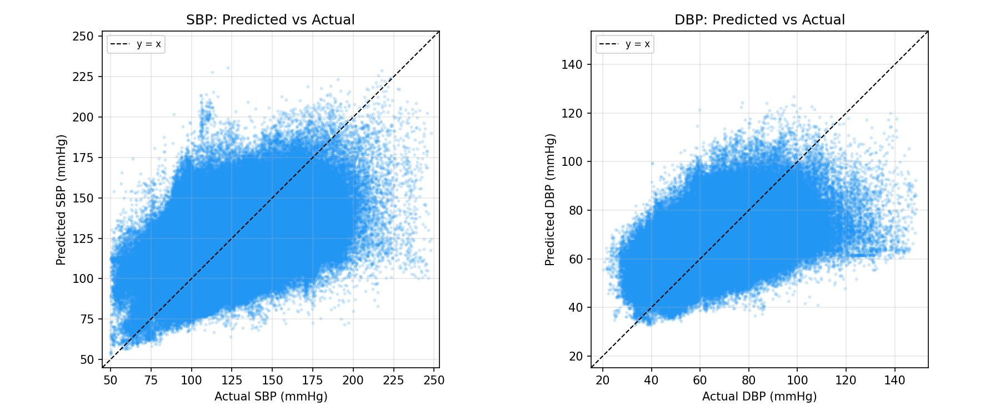       | 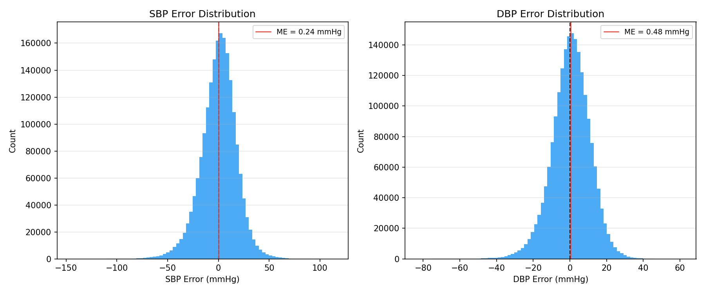       |        | 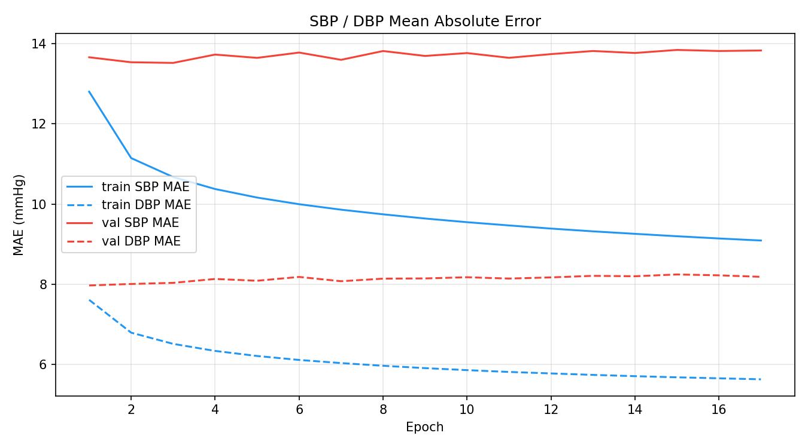       |
| st_resnet        |         |         |         |         |
| xresnet1d        |         |         |         |         |
| resnet1d         |          |          | 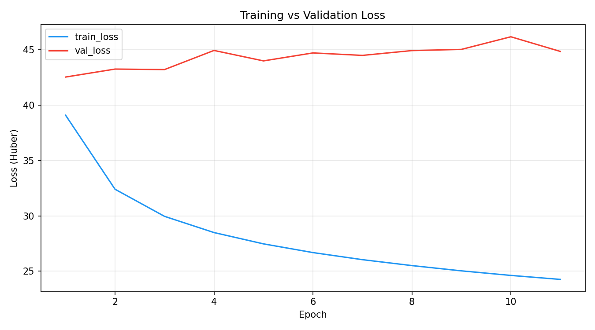         | 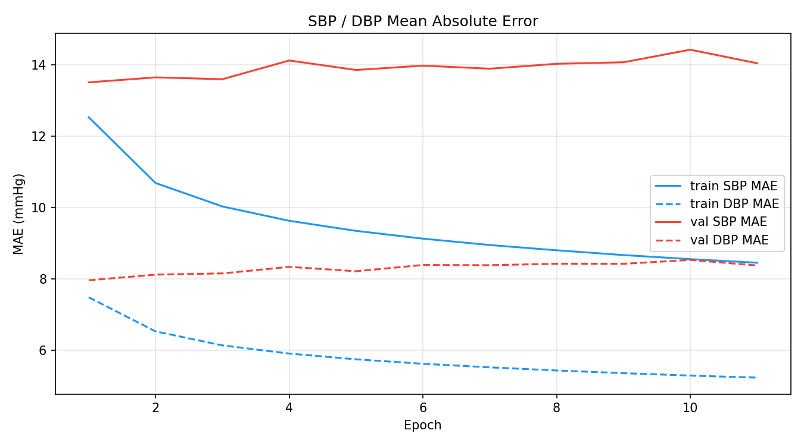         |
| resnet1d_mini    |     |     |     | 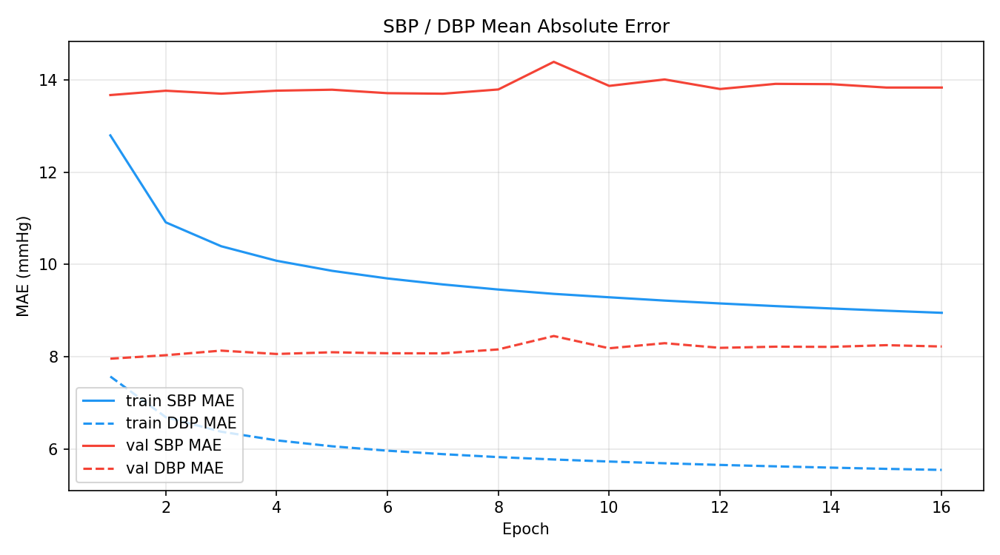    |
| resnet1d_tiny    |     |     |     |     |
| resnet1d_micro   |    |    |    |    |
| mtae             |              |              |              |              |
| mtae_tr          |           |           |           |           |
| pulse_resnet1d   |    | 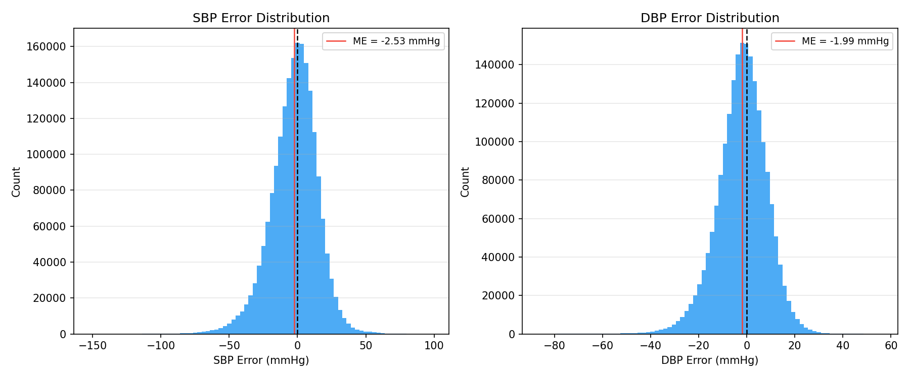   |    |    |
| pulsew_resnet1d  | 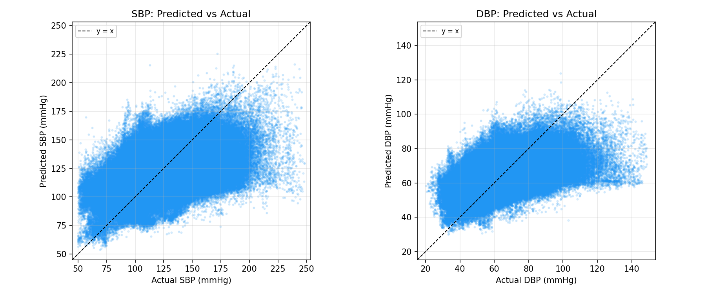  |   |   | 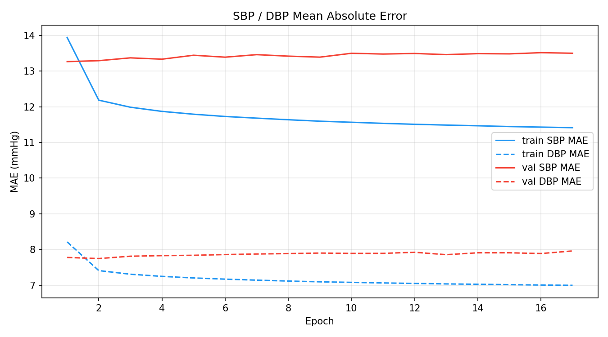  |
| pulsewo_resnet1d |  |  |  |  |

### 비교 개요 그래프

| 지표      | Scatter (PNG)                          | Ranking Bar                           |
| --------- | -------------------------------------- | ------------------------------------- |
| MAE       |             |             |
| ME        |              |              |
| SD        |              |              |
| RMSE      |            |            |
| 추론 시간 |  |  |

## 참고문헌

1. Lee, H.-C. et al. (2022). VitalDB, a high-fidelity multi-parameter vital signs database in surgical patients. *Scientific Data*, 9, 279.
2. Li, X. et al. (2026). ACFA: Adaptive Convolutional Feature Aggregation for Continuous Blood Pressure Estimation. *(2026 pre-print)*
3. Vanithamani, R. et al. (2025). Autoencoder-LSTM for Non-invasive Blood Pressure Estimation from PPG. *IEEE TBME* (2025).
4. Mohammadi, H. et al. (2025). CNN-BiLSTM with Additive Attention for PPG-Based Blood Pressure Estimation. *Sensors* (2025).
5. Kachuee, M. et al. (2017). Cuffless Blood Pressure Estimation Algorithms for Continuous Health-Care Monitoring. *IEEE TBME*, 64(4), 859–869.
6. Slapničar, G. et al. (2019). Blood Pressure Estimation from Photoplethysmogram Using a Spectro-Temporal Deep Neural Network. *Sensors*, 19(15), 3420.
7. O'Brien, E. et al. (1993). The British Hypertension Society protocol for the evaluation of blood pressure measuring devices. *Journal of Hypertension*, 11(Suppl 2), S43–S63.
8. Association for the Advancement of Medical Instrumentation (2013). *ANSI/AAMI/ISO 81060-2: Non-invasive sphygmomanometers. Part 2: Clinical investigation of intermittent automated measurement type.*
