# 모델 평가 결과 (Evaluation Results)

작성일: 2026-06-05  
평가 대상: VitalDB PPG → SBP/DBP 직접 회귀 모델  
평가 데이터셋: `data/dataset/test` (case-level held-out, 672 cases, 1,987,561 segments)

## 1. 개요

본 문서는 `bpe-vitaldb` 프로젝트에서 개발·학습된 혈압 추정 모델들의 테스트셋 평가
결과를 종합적으로 정리한다. 모든 모델은 동일한 VitalDB case-level split, 동일한
전처리(125 Hz, 8초 세그먼트, z-score 정규화), 동일한 하이퍼파라미터(AdamW, lr=1e-3,
batch=256, patience=15, seed=42)로 학습되어 공정한 비교가 가능하다.

평가는 `scripts/eval-model.py`를 사용하며 `best.pt` 체크포인트(validation loss 기준)를
테스트셋에 단 1회 적용하는 방식으로 수행된다.

## 2. 평가 환경

| 항목                | 내용                                                                    |
| ------------------- | ----------------------------------------------------------------------- |
| 데이터셋            | VitalDB (수술 환자 6,388 케이스 중 PPG+ABP 보유 케이스)                 |
| 입력 신호           | PPG (`SNUADC/PLETH`), 125 Hz, 8초 (1000 샘플)                           |
| 레이블              | SBP/DBP 평균값 (mmHg), 세그먼트 내 `Solar8000/ART_SBP/DBP` 기반         |
| case 분할           | train 60% / val 20% / test 20% (case-level, seed=42)                    |
| 테스트 케이스 수    | 672 cases                                                               |
| 테스트 세그먼트 수  | 1,987,561 segments                                                      |
| 평가 체크포인트     | 각 모델의 `best.pt` (val loss 최소 epoch)                               |
| 공통 하이퍼파라미터 | lr=1e-3, weight_decay=1e-4, batch_size=256, max_epochs=100, patience=15 |

## 3. 평가 지표

### 3.1 정량 지표

| 지표     | 정의                               | 의미                                                      |
| -------- | ---------------------------------- | --------------------------------------------------------- |
| **MAE**  | Mean Absolute Error (mmHg)         | 예측 오차의 절대값 평균. 임상에서 가장 직관적인 오차 지표 |
| **ME**   | Mean Error (mmHg)                  | 예측 편향(bias). 양수=과추정, 음수=과소추정               |
| **SD**   | Standard Deviation of error (mmHg) | 예측 오차의 산포. AAMI 기준의 핵심 지표                   |
| **RMSE** | Root Mean Squared Error (mmHg)     | 이상치에 민감한 오차. √(ME² + SD²)                        |

### 3.2 임상 표준 기준

**AAMI (Association for the Advancement of Medical Instrumentation) 기준**

혈압계 임상 허용 기준. 다음 두 조건을 동시에 만족해야 한다.

| 조건 | 임계값    |
| ---- | --------- |
| ME   | ≤ ±5 mmHg |
| SD   | ≤ 8 mmHg  |

**BHS (British Hypertension Society) 등급**

오차 분포에 따른 누적 비율 기반 등급 체계.

| 등급 | ±5 mmHg 이내 | ±10 mmHg 이내 | ±15 mmHg 이내 |
| ---- | ------------ | ------------- | ------------- |
| A    | ≥ 60%        | ≥ 85%         | ≥ 95%         |
| B    | ≥ 50%        | ≥ 75%         | ≥ 90%         |
| C    | ≥ 40%        | ≥ 65%         | ≥ 85%         |
| D    | C 미달       |               |               |

> **임상 적용 기준**: 혈압계로서 AAMI 통과 + BHS Grade B 이상이 임상 사용의 최소 요건으로
> 통용된다. Grade C는 연구용 참고 기준으로 활용된다.

## 4. 평가 대상 모델

| 모델명             | 분류                   | 파라미터 수 | 레이어 수 | 입력 방식              | 평가 여부 |
| ------------------ | ---------------------- | ----------- | --------- | ---------------------- | --------- |
| `naive`            | 베이스라인             | —           | —         | 8초 전체 (1000 샘플)   | ✅         |
| `resnet1d`         | ResNet1D 계열          | 2.18 M      | 100       | 8초 전체               | ✅         |
| `resnet1d_mini`    | ResNet1D 계열          | 964.4 K     | 60        | 8초 전체               | ✅         |
| `resnet1d_tiny`    | ResNet1D 계열          | 60.6 K      | 34        | 8초 전체               | ✅         |
| `resnet1d_micro`   | ResNet1D 계열          | 15.1 K      | 21        | 8초 전체               | ✅         |
| `st_resnet`        | 다중 채널              | 478.9 K     | 140       | PPG + VPG + APG        | ✅         |
| `minception`       | 다중 스케일            | 440.7 K     | 134       | 8초 전체               | ✅         |
| `xresnet1d`        | 대형 ResNet            | 9.47 M      | 484       | 8초 전체               | ✅         |
| `xresnet1d101`     | 대형 ResNet            | —           | —         | 8초 전체               | ✅         |
| `pulse_resnet1d`   | 맥박 분할              | ~58 K       | —         | 8×125 샘플 (맥박 단위) | ✅         |
| `pulsewo_resnet1d` | 맥박 분할              | —           | —         | 8×125 샘플             | ✅         |
| `pulsew_resnet1d`  | 맥박 분할              | —           | —         | 8×125 샘플             | ✅         |
| `mtae`             | 다중 태스크 오토인코더 | 119.5 K     | 37        | 8초 전체               | ✅         |
| `mtae_tr`          | MTAE + Transformer     | 109.4 K     | 93        | 8초 전체               | ✅         |

> `naive`: 훈련셋 레이블의 평균값을 상수 출력하는 단순 기준 모델  
> `st_resnet`: PPG의 1차(VPG)·2차(APG) 미분을 추가 채널로 사용  
> `pulse_resnet1d` 계열: 1000 샘플 입력을 8개의 125 샘플 맥박 구간으로 분할 후 공유 백본 처리  
> `mtae`: CNN 인코더/디코더 + BP 헤드 구조, 재구성 손실(재구성 가중치 0.5)과 BP 회귀 손실을 동시에 최적화  
> `mtae_tr`: mtae의 CNN을 Transformer로 교체한 변형. 패치 임베딩 → CLS 토큰 Transformer 인코더 → MAE 스타일 디코더

## 5. 테스트셋 정량 평가 결과

### 5.1 SBP(수축기혈압) 종합 비교

| 모델                 | MAE ↓     | ME    | SD    | RMSE  | ±5%       | ±10%      | ±15%      | BHS   | AAMI |
| -------------------- | --------- | ----- | ----- | ----- | --------- | --------- | --------- | ----- | ---- |
| `naive`              | 15.65     | -2.41 | 20.22 | 20.37 | 20.7%     | 40.4%     | 57.4%     | D     | ❌    |
| `resnet1d_mini`      | 13.51     | +0.36 | 17.73 | 17.73 | 24.6%     | 47.0%     | 64.8%     | D     | ❌    |
| `minception`         | 13.40     | +0.24 | 17.56 | 17.56 | 24.9%     | 47.2%     | 65.0%     | D     | ❌    |
| `resnet1d`           | 13.39     | -3.06 | 17.38 | 17.65 | 25.3%     | 47.8%     | 65.4%     | D     | ❌    |
| `pulsewo_resnet1d`   | 13.38     | -3.37 | 17.32 | 17.65 | 25.2%     | 47.7%     | 65.6%     | D     | ❌    |
| `mtae_tr`            | 13.25     | -1.34 | 17.40 | 17.45 | 25.1%     | 47.8%     | 66.0%     | D     | ❌    |
| `xresnet1d`          | 13.25     | +1.65 | 17.12 | 17.20 | 24.6%     | 46.7%     | 65.0%     | D     | ❌    |
| `pulse_resnet1d`     | 13.18     | -2.53 | 17.22 | 17.41 | 25.6%     | 48.3%     | 66.2%     | D     | ❌    |
| `xresnet1d101`       | 13.12     | +0.70 | 17.03 | 17.05 | 24.8%     | 47.4%     | 65.7%     | D     | ❌    |
| `pulsew_resnet1d`    | 13.11     | -1.99 | 17.18 | 17.29 | 25.9%     | 48.5%     | 66.4%     | D     | ❌    |
| `mtae`               | 13.09     | -1.29 | 17.18 | 17.23 | 25.7%     | 48.4%     | 66.3%     | D     | ❌    |
| `st_resnet`          | 13.00     | -2.04 | 17.02 | 17.14 | 25.9%     | 48.8%     | 66.7%     | D     | ❌    |
| **`resnet1d_micro`** | **12.96** | -1.52 | 16.97 | 17.03 | 25.7%     | 48.6%     | 66.7%     | **D** | ❌    |
| **`resnet1d_tiny`**  | **12.95** | -2.21 | 16.93 | 17.08 | **26.0%** | **49.0%** | **67.0%** | **D** | ❌    |

> ↓: 낮을수록 좋음. ME 부호: 양수=과추정, 음수=과소추정.  
> BHS 등급 기준으로 SBP ±5mmHg 이내 비율이 40%에 크게 미달하여 전 모델이 Grade D.

### 5.2 DBP(이완기혈압) 종합 비교

| 모델                 | MAE ↓    | ME    | SD        | RMSE      | ±5%       | ±10%      | ±15%      | BHS   | AAMI |
| -------------------- | -------- | ----- | --------- | --------- | --------- | --------- | --------- | ----- | ---- |
| `naive`              | 9.42     | -1.20 | 12.14     | 12.20     | 33.6%     | 61.8%     | 80.9%     | D     | ❌    |
| `minception`         | 8.19     | +0.48 | 10.60     | 10.61     | 39.0%     | 68.3%     | 85.7%     | D     | ❌    |
| `resnet1d_mini`      | 8.15     | -0.56 | 10.63     | 10.64     | 39.5%     | 68.8%     | 86.0%     | D     | ❌    |
| `mtae_tr`            | 8.13     | -0.88 | 10.64     | 10.68     | 40.2%     | 69.1%     | 85.9%     | **C** | ❌    |
| `pulsewo_resnet1d`   | 8.11     | -1.32 | 10.56     | 10.64     | 40.1%     | 69.3%     | 86.1%     | **C** | ❌    |
| `resnet1d`           | 8.10     | -1.90 | 10.44     | 10.61     | 39.9%     | 69.5%     | 86.1%     | D     | ❌    |
| `mtae`               | 7.98     | -0.35 | 10.41     | 10.42     | 40.2%     | 69.7%     | 86.8%     | **C** | ❌    |
| `pulse_resnet1d`     | 8.02     | -1.99 | 10.35     | 10.54     | 40.4%     | 69.9%     | 86.6%     | **C** | ❌    |
| `xresnet1d`          | 7.95     | -0.21 | 10.40     | 10.40     | 40.6%     | 69.8%     | 86.7%     | **C** | ❌    |
| `pulsew_resnet1d`    | 7.91     | -0.75 | 10.34     | 10.37     | 41.0%     | 70.2%     | 86.9%     | **C** | ❌    |
| `st_resnet`          | 7.93     | +0.07 | 10.33     | 10.33     | 40.3%     | 69.9%     | 87.0%     | **C** | ❌    |
| `xresnet1d101`       | 7.89     | +0.34 | 10.27     | 10.27     | 40.8%     | 70.1%     | 86.9%     | **C** | ❌    |
| `resnet1d_tiny`      | 7.86     | -0.62 | 10.26     | 10.28     | 41.1%     | 70.2%     | 87.1%     | **C** | ❌    |
| **`resnet1d_micro`** | **7.83** | -0.88 | **10.23** | **10.27** | **41.3%** | **70.6%** | **87.3%** | **C** | ❌    |

> DBP에서 Grade C 달성 모델: `mtae_tr`, `pulsewo_resnet1d`, `mtae`, `pulse_resnet1d`, `xresnet1d`,
> `pulsew_resnet1d`, `st_resnet`, `xresnet1d101`, `resnet1d_tiny`, `resnet1d_micro` (10종).  
> AAMI 기준: SD가 모든 모델에서 10 mmHg를 초과하여 전 모델 불통과 (기준: SD ≤ 8 mmHg).

### 5.3 종합 순위 (SBP MAE + DBP MAE 합산 기준)

| 순위 | 모델               | SBP MAE | DBP MAE | 합산      | DBP BHS |
| ---- | ------------------ | ------- | ------- | --------- | ------- |
| 1    | `resnet1d_micro`   | 12.96   | 7.83    | **20.79** | C       |
| 2    | `resnet1d_tiny`    | 12.95   | 7.86    | **20.81** | C       |
| 3    | `st_resnet`        | 13.00   | 7.93    | **20.93** | C       |
| 4    | `xresnet1d101`     | 13.12   | 7.89    | **21.01** | C       |
| 5    | `pulsew_resnet1d`  | 13.11   | 7.91    | **21.02** | C       |
| 6    | `mtae`             | 13.09   | 7.98    | **21.07** | C       |
| 7    | `pulse_resnet1d`   | 13.18   | 8.02    | **21.20** | C       |
| 8    | `xresnet1d`        | 13.25   | 7.95    | **21.20** | C       |
| 9    | `mtae_tr`          | 13.25   | 8.13    | **21.38** | C       |
| 10   | `pulsewo_resnet1d` | 13.38   | 8.11    | **21.49** | C       |
| 11   | `resnet1d`         | 13.39   | 8.10    | **21.49** | D       |
| 12   | `minception`       | 13.40   | 8.19    | **21.59** | D       |
| 13   | `resnet1d_mini`    | 13.51   | 8.15    | **21.66** | D       |
| —    | `naive`            | 15.65   | 9.42    | **25.07** | D       |

## 6. 모델별 상세 평가

### 6.1 naive (베이스라인)

훈련 실행: `20260604_102959` | best_epoch: 17

```
SBP — MAE: 15.65, ME: -2.41, SD: 20.22, RMSE: 20.37 | Grade D | AAMI: ❌
DBP — MAE:  9.42, ME: -1.20, SD: 12.14, RMSE: 12.20 | Grade D | AAMI: ❌
```

훈련셋 통계값 근사 출력 모델. metrics.csv에서 epoch 2부터 train_loss가 50.59 수준에서
고정되고 val_loss도 거의 변화 없음을 확인. 학습률이 낮아져도 전혀 수렴하지 않는다.
이후 32 에폭까지 학습하였으나 개선 없이 early stopping 발동.

**의의**: 딥러닝 모델이 naive 대비 SBP 15-20%, DBP 12-17% 수준의 MAE 개선을 달성함을
확인. 모든 학습 모델이 naive보다 유의미하게 우수하다.

| 그래프               |                                                      |
| -------------------- | ---------------------------------------------------- |
| Prediction vs Actual |   |
| Error Distribution   | 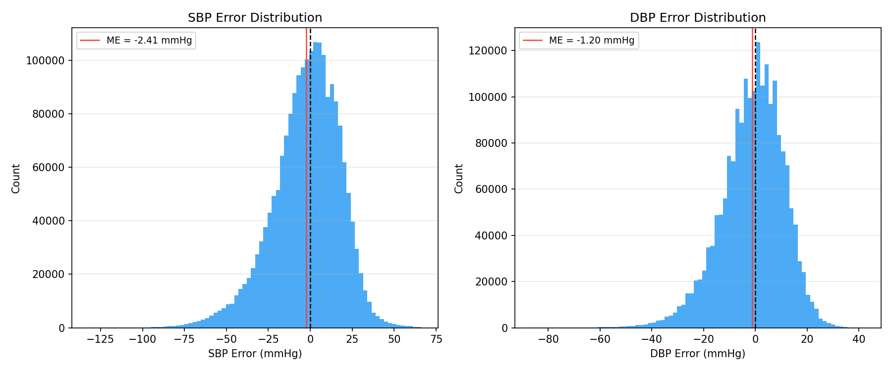 |
| 훈련 손실 곡선       |  |
| 훈련 MAE 곡선        | 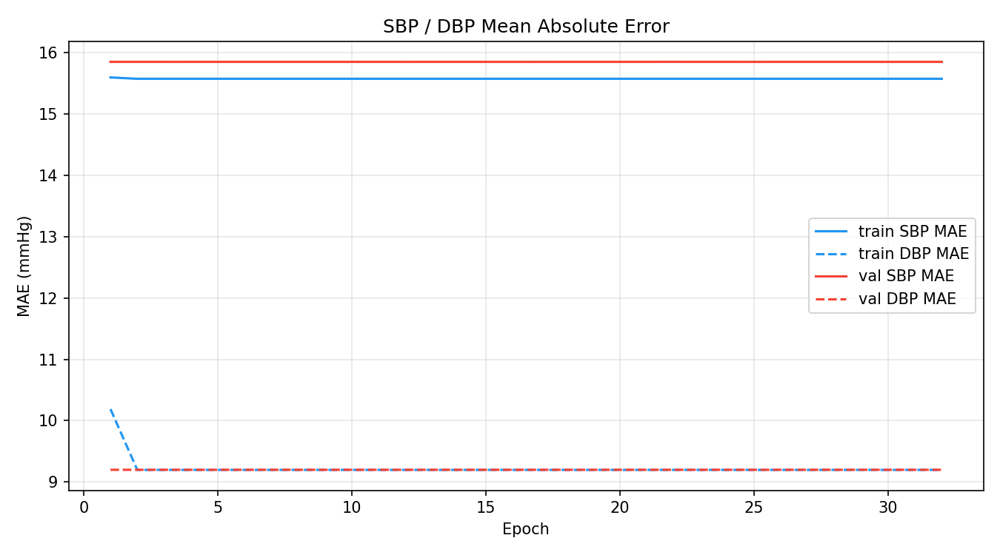  |


### 6.2 resnet1d (기준 모델)

훈련 실행: `20260602_144516` | best_epoch: **1**

```
SBP — MAE: 13.39, ME: -3.06, SD: 17.38, RMSE: 17.65 | Grade D | AAMI: ❌
DBP — MAE:  8.10, ME: -1.90, SD: 10.44, RMSE: 10.61 | Grade D | AAMI: ❌
```

2.18M 파라미터의 100-layer 1D ResNet. 세그먼트 단위로 SBP/DBP를 직접 회귀.
**epoch 1에서 val_loss 42.53으로 최선**, 이후 epoch 2부터 val_loss 43.24로 즉각
증가하여 early stopping이 epoch 11에 발동. 약 23,000 배치(~590만 세그먼트)를 1 에폭에
처리하므로, 1 에폭만에 수렴이 발생한다.

ME = -3.06 mmHg로 SBP를 다소 과소추정하는 경향이 있다. DBP는 BHS Grade D로 ±5mmHg
이내 비율이 39.9%로 C 등급(40%) 문턱 직전이다.

| 그래프               |                                                         |
| -------------------- | ------------------------------------------------------- |
| Prediction vs Actual | 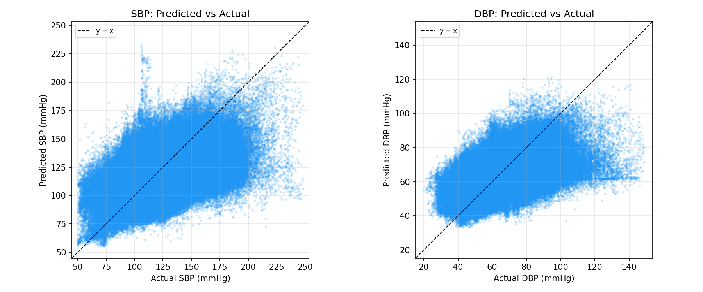  |
| Error Distribution   |  |
| 훈련 손실 곡선       |  |
| 훈련 MAE 곡선        |   |

### 6.3 resnet1d_mini

훈련 실행: `20260604_155925` | best_epoch: **1**

```
SBP — MAE: 13.51, ME: +0.36, SD: 17.73, RMSE: 17.73 | Grade D | AAMI: ❌
DBP — MAE:  8.15, ME: -0.56, SD: 10.63, RMSE: 10.64 | Grade D | AAMI: ❌
```

ResNet1D의 50% 깊이 축소 버전 (964.4K 파라미터, 60 layers). **resnet1d보다 오히려
성능이 열화** (SBP MAE +0.12, DBP MAE +0.05). ME가 SBP/DBP 모두 ±1 mmHg 이내로
편향이 작지만 산포(SD)가 커서 전체 정확도는 떨어진다. best_epoch=1로 즉각 과적합 발생.

ResNet1D 계열에서 깊이를 50%로 줄여도 성능이 향상되지 않으며, 오히려 더 작은
resnet1d_tiny/micro가 우수한 결과를 보여 단순히 채널·깊이를 균등 축소하는 전략의
한계를 시사한다.

| 그래프               |                                                              |
| -------------------- | ------------------------------------------------------------ |
| Prediction vs Actual | 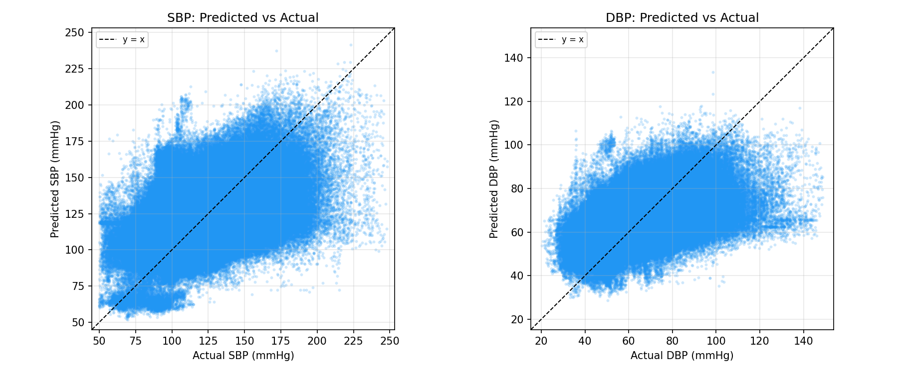  |
| Error Distribution   | 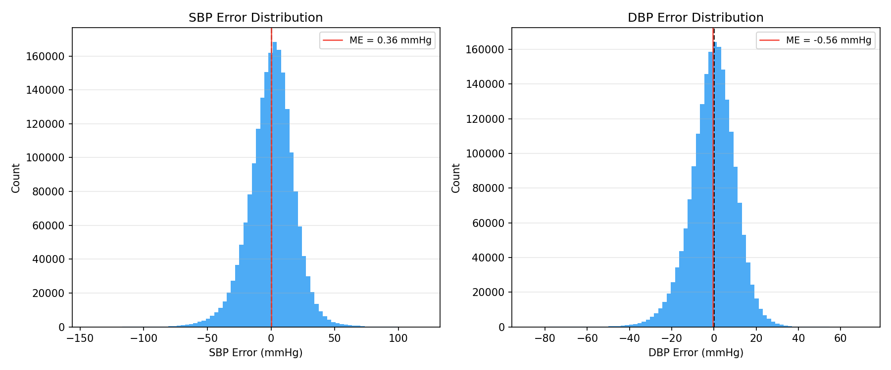 |
| 훈련 손실 곡선       | 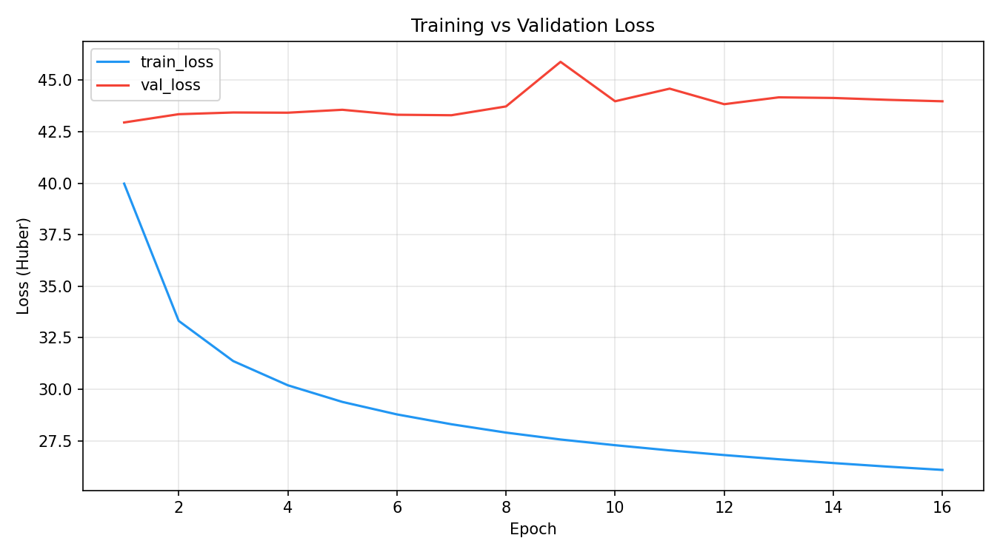 |
| 훈련 MAE 곡선        |   |

### 6.4 resnet1d_tiny

훈련 실행: `20260602_174728` | best_epoch: **1**

```
SBP — MAE: 12.95, ME: -2.21, SD: 16.93, RMSE: 17.08 | Grade D | AAMI: ❌
DBP — MAE:  7.86, ME: -0.62, SD: 10.26, RMSE: 10.28 | Grade C | AAMI: ❌
```

ResNet1D의 25% 깊이 축소 버전 (60.6K 파라미터, 34 layers). **전체 모델 중 SBP MAE
2위(12.95), DBP MAE 2위(7.86)** 달성. 파라미터 수는 resnet1d의 2.7%에 불과하지만
성능은 오히려 우수하다. DBP에서 BHS Grade C를 달성하며 ±5/10/15mmHg 이내 비율이
각 41.1%/70.2%/87.1%로 높다. SBP ME = -2.21로 과소추정 경향이 있다.

**주요 시사점**: 극히 소형 모델이 대형 모델을 능가하는 현상은 현재 훈련 환경에서
과적합이 주된 성능 저해 요인임을 강력히 시사한다.

| 그래프               |                                                              |
| -------------------- | ------------------------------------------------------------ |
| Prediction vs Actual | 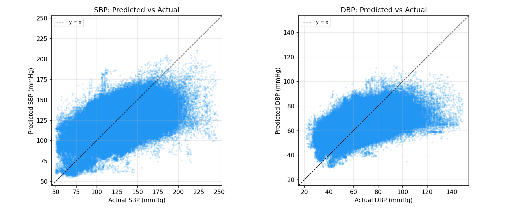  |
| Error Distribution   |  |
| 훈련 손실 곡선       | 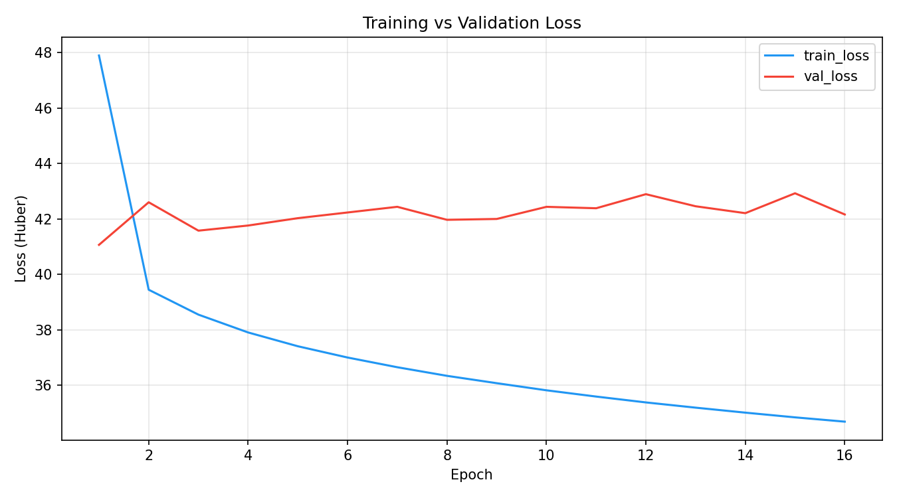 |
| 훈련 MAE 곡선        | 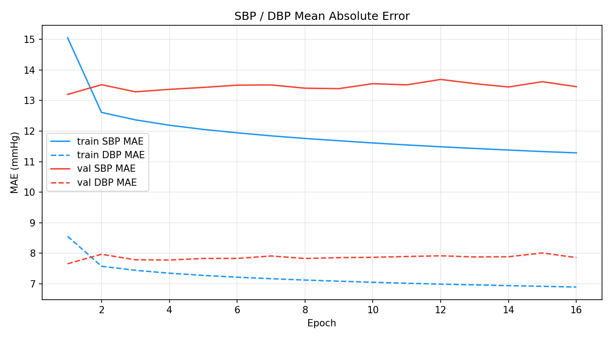  |

### 6.5 resnet1d_micro

훈련 실행: `20260602_174708` | best_epoch: **20** ← 유일한 정상 수렴 사례

```
SBP — MAE: 12.96, ME: -1.52, SD: 16.97, RMSE: 17.03 | Grade D | AAMI: ❌
DBP — MAE:  7.83, ME: -0.88, SD: 10.23, RMSE: 10.27 | Grade C | AAMI: ❌
```

ResNet1D의 10% 깊이 축소 버전 (15.1K 파라미터, 21 layers). **전체 모델 중 DBP MAE
최고(7.83)**, SBP MAE 3위(12.96). **best_epoch=20으로 유일하게 다수 에폭에서 꾸준히
개선되는 정상적인 학습 곡선을 보인다**: val_loss가 epoch 1(43.81) → epoch 12(40.98) →
epoch 20(40.90)으로 감소. 35 에폭 후 early stopping 발동.

SBP/DBP ME가 각각 -1.52/-0.88 mmHg로 가장 편향이 작은 모델 중 하나. RMSE에서도
SBP 17.03, DBP 10.27로 전체 최고 수준. DBP ±5/10/15mmHg 이내 비율이 각
41.3%/70.6%/87.3%로 DBP Grade C 모델 중 최고 수치를 기록한다.

**유일하게 과적합 없이 수렴하는 모델**로, 파라미터 수가 너무 적어 단일 에폭 내
과적합이 일어나지 않는 구조적 특성을 갖는다. 단, 표현력 한계로 절대 성능 향상 폭이
제한적이다.

| 그래프               |                                                               |
| -------------------- | ------------------------------------------------------------- |
| Prediction vs Actual | 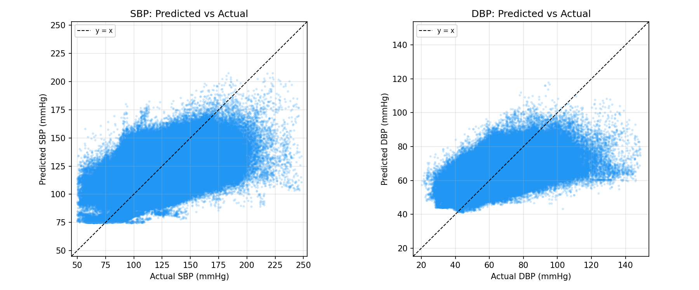  |
| Error Distribution   |  |
| 훈련 손실 곡선       |  |
| 훈련 MAE 곡선        | 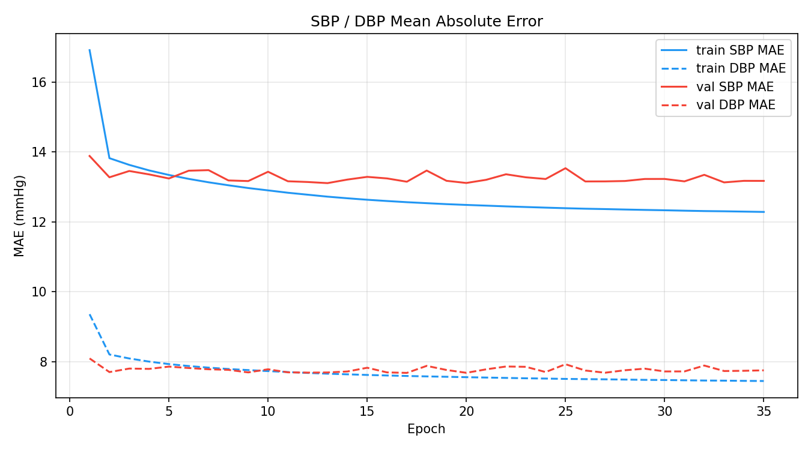  |

### 6.6 st_resnet (Spectro-Temporal ResNet)

훈련 실행: `20260602_162406` | best_epoch: **1**

```
SBP — MAE: 13.00, ME: -2.04, SD: 17.02, RMSE: 17.14 | Grade D | AAMI: ❌
DBP — MAE:  7.93, ME: +0.07, SD: 10.33, RMSE: 10.33 | Grade C | AAMI: ❌
```

PPG와 그 1차(VPG)·2차(APG) 미분을 3채널 입력으로 사용하는 Slapničar et al. (2019)
기반 모델 (478.9K 파라미터). 직접 회귀 계열 중 **SBP MAE 3위(13.00)**, DBP Grade C
달성. DBP ME = +0.07 mmHg로 **전 모델 중 편향이 가장 작아** 사실상 무편향 예측을 보인다.

원 논문(MIMIC-III, leave-one-out)의 SBP MAE 9.43 / DBP MAE 6.88과 비교하면 본
평가에서 각각 3.57 / 1.05 mmHg 높다. 이는 본 프로젝트가 calibration-free, case-level
hold-out 방식을 사용하는 반면, 원 논문은 subject-dependent split을 사용했기 때문으로
분석된다.

| 그래프               |                                                          |
| -------------------- | -------------------------------------------------------- |
| Prediction vs Actual | 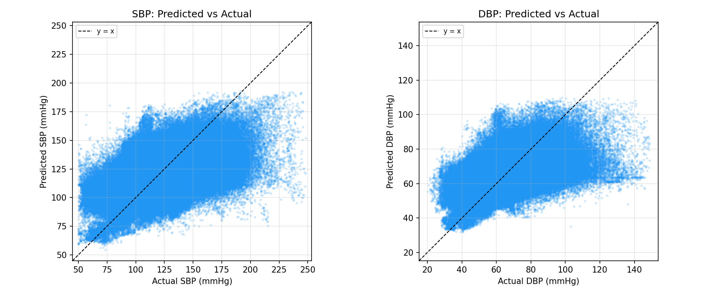  |
| Error Distribution   |  |
| 훈련 손실 곡선       |  |
| 훈련 MAE 곡선        | 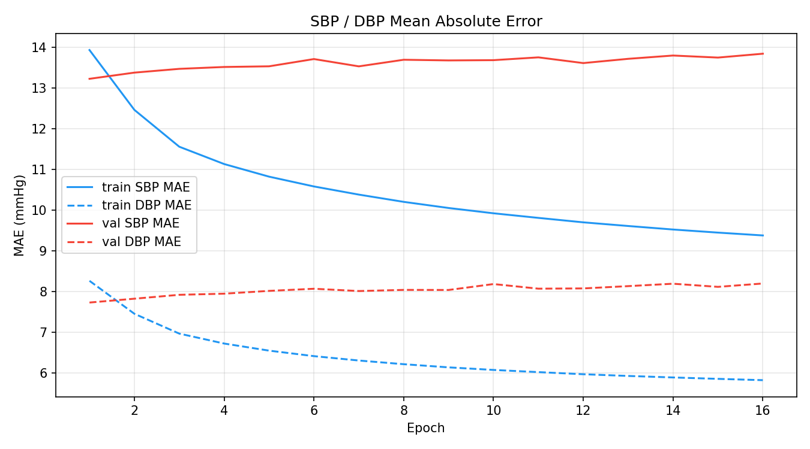  |

### 6.7 minception (Multi-scale Inception 1D)

훈련 실행: `20260602_173125` | best_epoch: **2**

```
SBP — MAE: 13.40, ME: +0.24, SD: 17.56, RMSE: 17.56 | Grade D | AAMI: ❌
DBP — MAE:  8.19, ME: +0.48, SD: 10.60, RMSE: 10.61 | Grade D | AAMI: ❌
```

다중 스케일 Inception 블록 기반 모델 (440.7K 파라미터, 134 layers). ME가 SBP +0.24,
DBP +0.48로 양의 편향(과추정)을 보이며, 다른 모델들의 음의 편향과 대조적이다.
best_epoch=2로 극히 초기에 최선 검증 성능을 기록하고 이후 단조 증가. DBP BHS ±5mmHg
이내가 39.0%로 Grade C 문턱(40%)에 0.1pp 못 미쳐 Grade D로 분류된다.

원 논문 기준(NBPDB 벤치마크, demographic 포함) SBP 4.75 / DBP 2.90 mmHg와의 차이는
주로 demographic 채널 부재와 데이터셋 차이에 기인한다.

| 그래프               |                                                           |
| -------------------- | --------------------------------------------------------- |
| Prediction vs Actual |   |
| Error Distribution   |  |
| 훈련 손실 곡선       | 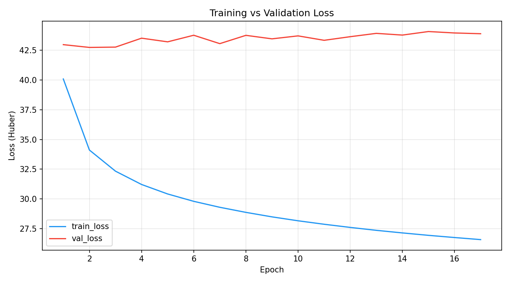 |
| 훈련 MAE 곡선        |   |

### 6.8 xresnet1d (Deep XResNet-101-style)

훈련 실행: `20260604_155819` | best_epoch: **1**

```
SBP — MAE: 13.25, ME: +1.65, SD: 17.12, RMSE: 17.20 | Grade D | AAMI: ❌
DBP — MAE:  7.95, ME: -0.21, SD: 10.40, RMSE: 10.40 | Grade C | AAMI: ❌
```

9.47M 파라미터의 대형 XResNet1D (484 layers). SBP ME = +1.65로 가장 큰 양의 편향.
DBP Grade C 달성. 파라미터 대비 성능은 resnet1d_micro/tiny에 비해 크게 열화되어
**대형 모델의 과적합 문제를 가장 극명하게 보여주는 사례**. best_epoch=1 이후
val_loss가 epoch 2부터 급격히 상승(41.78 → 42.56 → 42.56 → 43.46 →…).

| 그래프               |                                                          |
| -------------------- | -------------------------------------------------------- |
| Prediction vs Actual |   |
| Error Distribution   |  |
| 훈련 손실 곡선       | 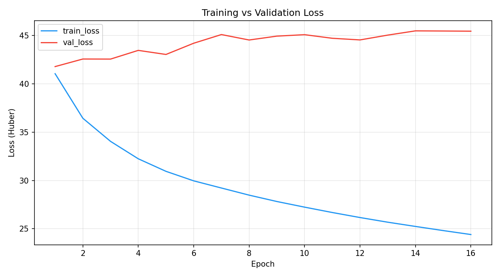 |
| 훈련 MAE 곡선        |   |

### 6.9 xresnet1d101

훈련 실행: `20260604_155614` | best_epoch: **1**

```
SBP — MAE: 13.12, ME: +0.70, SD: 17.03, RMSE: 17.05 | Grade D | AAMI: ❌
DBP — MAE:  7.89, ME: +0.34, SD: 10.27, RMSE: 10.27 | Grade C | AAMI: ❌
```

XResNet1D의 101-layer 변형. xresnet1d보다 SBP MAE 0.14, DBP MAE 0.06 개선. ME가
SBP +0.70, DBP +0.34로 양의 편향이 작고 비교적 균형잡힌 예측. RMSE도 SBP 17.05로
전체 모델 중 낮은 편에 속한다. best_epoch=1이지만 SBP val_loss 상승 속도가 xresnet1d
대비 다소 느리다.

| 그래프               |                                                             |
| -------------------- | ----------------------------------------------------------- |
| Prediction vs Actual | 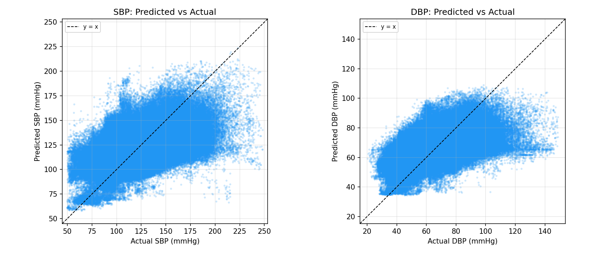  |
| Error Distribution   |  |
| 훈련 손실 곡선       | 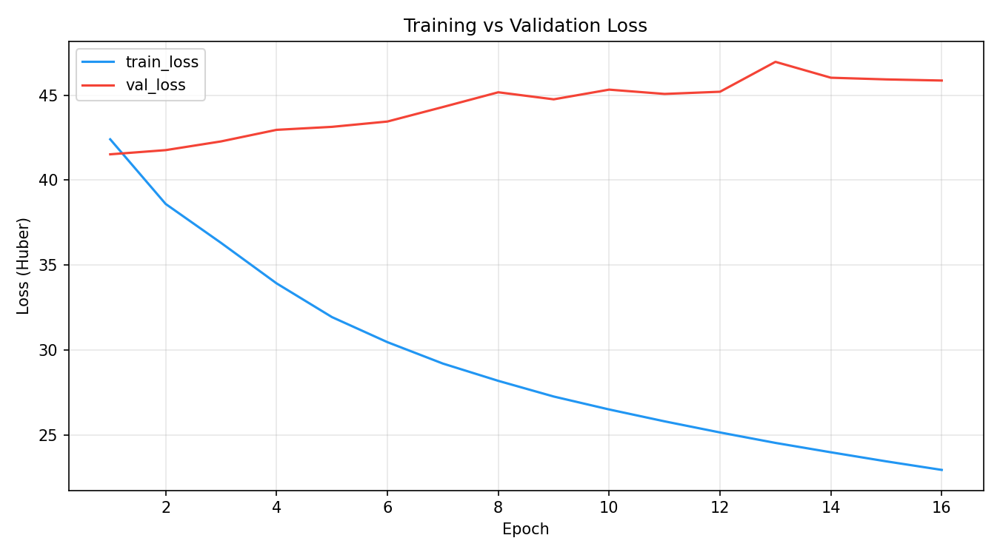 |
| 훈련 MAE 곡선        | 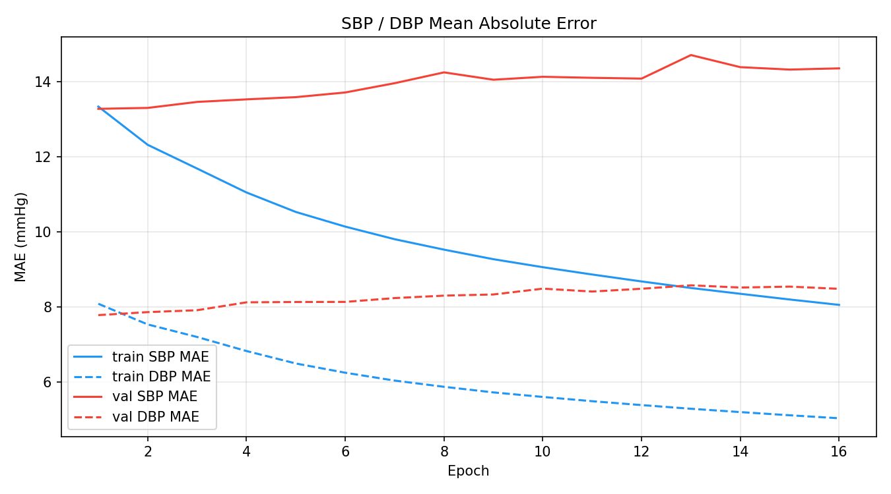  |

### 6.10 pulse_resnet1d (맥박 분할 ResNet1D)

훈련 실행: `20260604_131854` | best_epoch: **1**

```
SBP — MAE: 13.18, ME: -2.53, SD: 17.22, RMSE: 17.41 | Grade D | AAMI: ❌
DBP — MAE:  8.02, ME: -1.99, SD: 10.35, RMSE: 10.54 | Grade C | AAMI: ❌
```

8초 입력을 8개의 125 샘플(~1초, 단일 맥박) 구간으로 분할 후 공유 백본에 통과, 평균
집계하는 방식. 설계 동기는 맥박 단위 처리로 학습 신호를 명확히 하고 과적합을 줄이는
것이었다. ME가 SBP -2.53, DBP -1.99로 과소추정 경향이 강하다.

**resnet1d(2.18M) 대비 개선**: SBP MAE 13.18 vs 13.39 (-0.21), DBP MAE 8.02 vs 8.10
(-0.08). 단 best_epoch=1로 여전히 즉각 과적합 발생. 설계상 기대했던 수렴 개선 효과가
실제로는 관찰되지 않았다. DBP Grade C 달성.

| 그래프               |                                                               |
| -------------------- | ------------------------------------------------------------- |
| Prediction vs Actual | 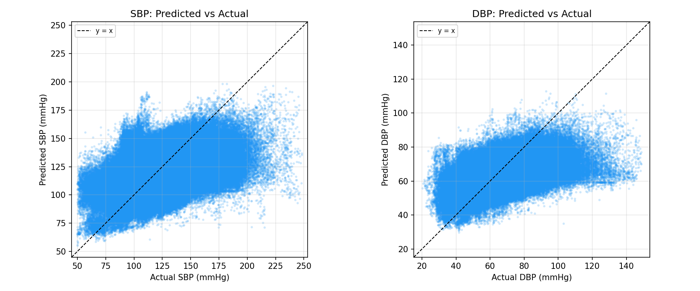  |
| Error Distribution   |  |
| 훈련 손실 곡선       | 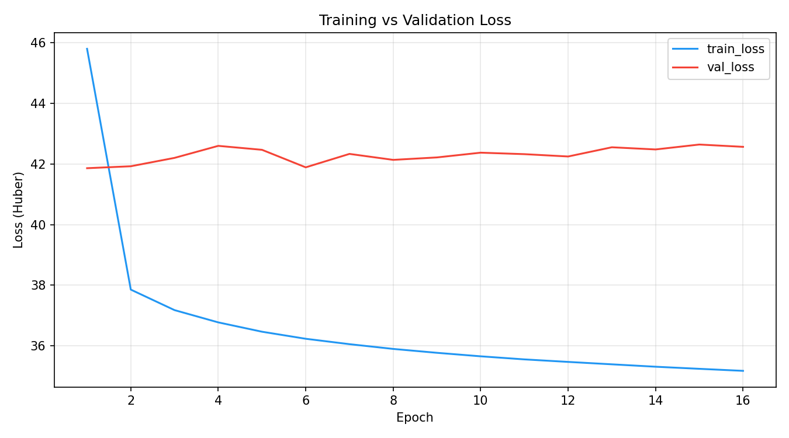 |
| 훈련 MAE 곡선        | 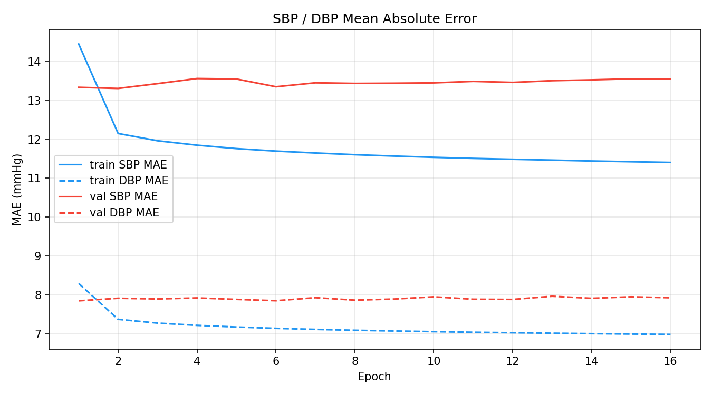  |

### 6.11 pulsewo_resnet1d (맥박 분할 변형)

훈련 실행: `20260604_180359` | best_epoch: **2**

```
SBP — MAE: 13.38, ME: -3.37, SD: 17.32, RMSE: 17.65 | Grade D | AAMI: ❌
DBP — MAE:  8.11, ME: -1.32, SD: 10.56, RMSE: 10.64 | Grade C | AAMI: ❌
```

pulse_resnet1d 계열의 변형 모델. ME가 SBP -3.37로 전 모델 중 가장 큰 음의 편향.
DBP Grade C를 간신히 달성(±5mmHg 40.1%). best_epoch=2로 pulse_resnet1d(1)보다
약간 더 안정적인 학습을 보이지만, val_loss 이후 즉각 상승. pulse_resnet1d 대비
SBP/DBP 성능 모두 열화.

| 그래프               |                                                                 |
| -------------------- | --------------------------------------------------------------- |
| Prediction vs Actual | 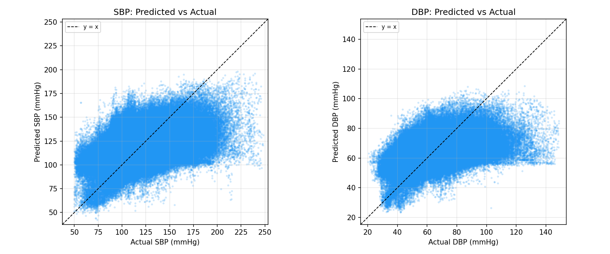  |
| Error Distribution   |  |
| 훈련 손실 곡선       | 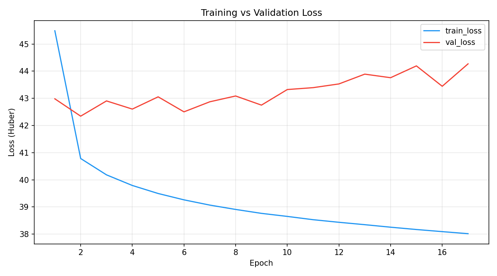 |
| 훈련 MAE 곡선        | 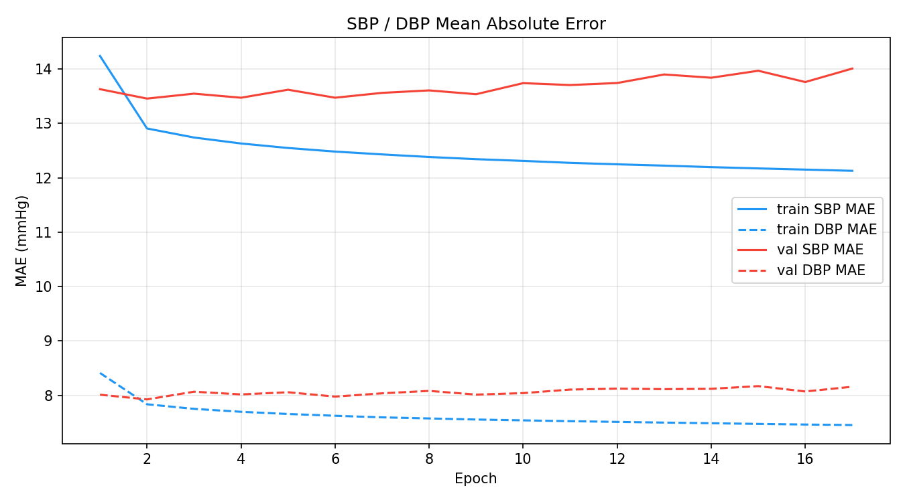  |

### 6.12 pulsew_resnet1d

훈련 실행: `20260604_150547` | best_epoch: **2**

```
SBP — MAE: 13.11, ME: -1.99, SD: 17.18, RMSE: 17.29 | Grade D | AAMI: ❌
DBP — MAE:  7.91, ME: -0.75, SD: 10.34, RMSE: 10.37 | Grade C | AAMI: ❌
```

pulse_resnet1d 계열의 변형 모델. **pulse 계열 중 DBP MAE 최고(7.91)**, SBP MAE도 pulse
계열 최고(13.11). DBP ±5/10/15mmHg 이내 비율이 41.0%/70.2%/86.9%로 pulse 계열 중 가장
높다. ME가 SBP -1.99, DBP -0.75로 pulse_resnet1d(-2.53/-1.99) 및 pulsewo_resnet1d
(-3.37/-1.32)보다 편향이 작고 균형잡혔다.

종합 순위 5위(SBP+DBP=21.02)로, xresnet1d101(21.01)과 거의 동등하면서 파라미터 수는
훨씬 적다. pulse 계열 3종 중 가장 우수한 결과를 보인다.

| 그래프               |                                                                |
| -------------------- | -------------------------------------------------------------- |
| Prediction vs Actual |   |
| Error Distribution   |  |
| 훈련 손실 곡선       | 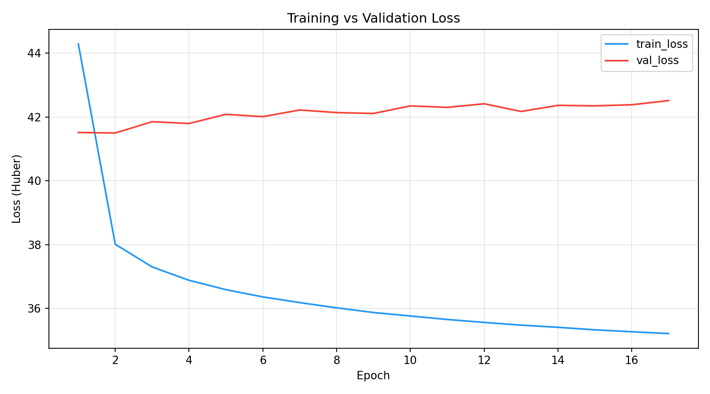 |
| 훈련 MAE 곡선        |   |

### 6.13 mtae (Multi-Task AutoEncoder)

훈련 실행: `20260605_095043` | best_epoch: **14**

```
SBP — MAE: 13.09, ME: -1.29, SD: 17.18, RMSE: 17.23 | Grade D | AAMI: ❌
DBP — MAE:  7.98, ME: -0.35, SD: 10.41, RMSE: 10.42 | Grade C | AAMI: ❌
```

CNN 인코더/디코더 + BP 헤드로 구성된 다중 태스크 오토인코더 (119.5K 파라미터). 학습
목적 함수는 BP 회귀 손실(가중치 0.5) + PPG 재구성 손실(가중치 0.5)의 가중 합산이다.

**best_epoch=14로 정상 수렴에 근접한 학습 곡선을 보인다**: val_loss가 epoch 1(21.36)에서
epoch 14(20.86)까지 꾸준히 감소 후 29 에폭에서 early stopping 발동. resnet1d_micro에
이어 두 번째로 다수 에폭에 걸쳐 수렴하는 모델이다. 재구성 손실이 정규화 역할을 하여
과적합을 억제한다고 볼 수 있다.

val_loss 스케일이 약 20~21 수준으로 다른 모델(~41~43)의 절반인 것은 다중 태스크 손실
구조 때문이다. BP 손실 ~41과 재구성 손실 ~2를 각 0.5 가중치로 합산하면 ~21.5이 된다.
**BP 성능만을 비교하면 val_sbp_mae=13.19, val_dbp_mae=7.73으로 측정 가능하다.**

SBP/DBP ME가 각각 -1.29/-0.35 mmHg로 편향이 작아 임상 안전성에 유리하다.
종합 순위 6위(SBP+DBP=21.07).

| 그래프               |                                                     |
| -------------------- | --------------------------------------------------- |
| Prediction vs Actual | 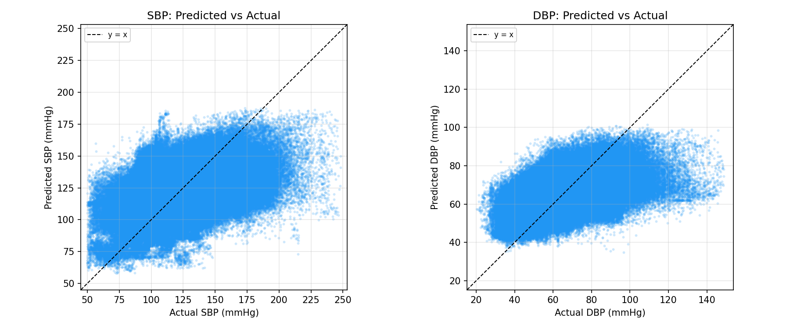  |
| Error Distribution   | 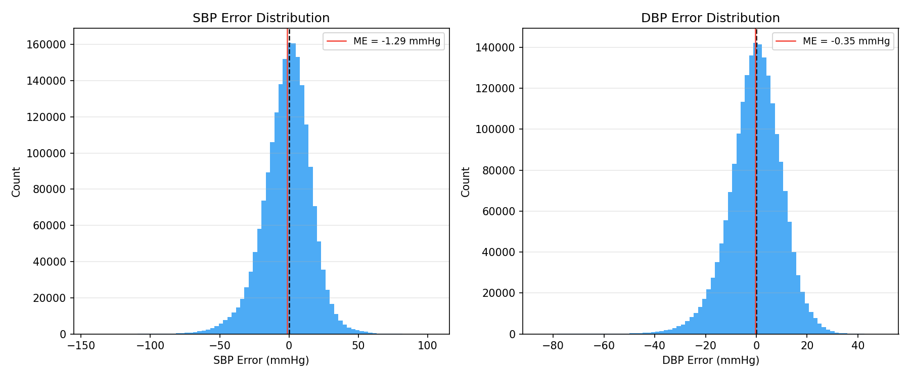 |
| 훈련 손실 곡선       |  |
| 훈련 MAE 곡선        |   |

### 6.14 mtae_tr (MTAE with Transformer)

훈련 실행: `20260605_103941` | best_epoch: **3**

```
SBP — MAE: 13.25, ME: -1.34, SD: 17.40, RMSE: 17.45 | Grade D | AAMI: ❌
DBP — MAE:  8.13, ME: -0.88, SD: 10.64, RMSE: 10.68 | Grade C | AAMI: ❌
```

mtae의 CNN 인코더/디코더를 Transformer로 교체한 변형 (109.4K 파라미터, 93 layers).
패치 임베딩(patch_size=25) → CLS 토큰 Transformer 인코더 → MAE 스타일 Transformer
디코더 구조이며, 인코더/디코더 각 4레이어(d_model=32, 4-head attention)를 사용한다.

best_epoch=3으로 mtae(14)보다 빨리 과적합이 시작된다. Transformer 구조의 빠른 수렴
특성과 dropout=0.1의 낮은 정규화 효과가 원인으로 분석된다. val_loss 21.27(epoch 3) →
21.87(epoch 18)로 서서히 증가, 18 에폭에서 early stopping 발동.

DBP Grade C 달성(±5mmHg 40.2%), 종합 순위 9위(SBP+DBP=21.38). mtae(CNN) 대비 SBP +0.16,
DBP +0.15 mmHg 열화로 현재 구성에서는 Transformer 교체가 성능 개선을 가져오지 못했다.

| 그래프               |                                                        |
| -------------------- | ------------------------------------------------------ |
| Prediction vs Actual |   |
| Error Distribution   | 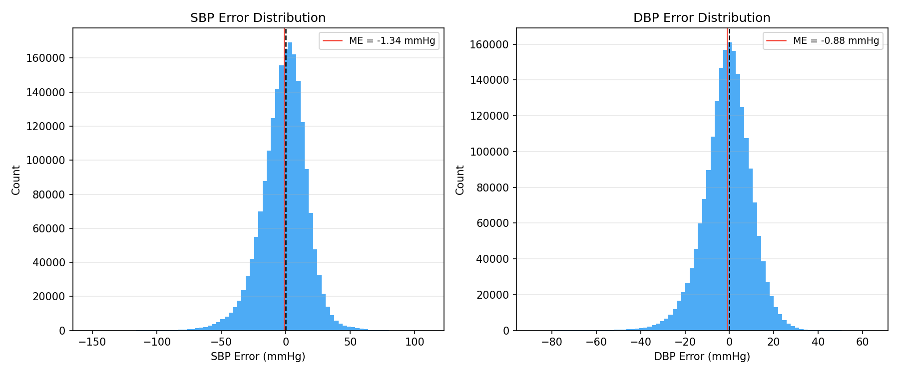 |
| 훈련 손실 곡선       | 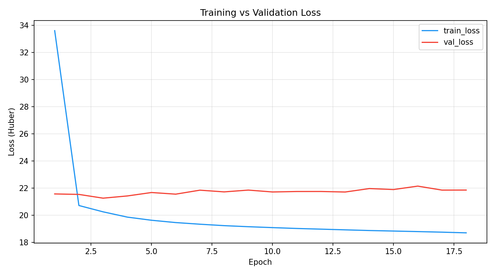 |
| 훈련 MAE 곡선        |   |

## 7. 훈련 과정 분석

### 7.1 Early Stopping 동작 요약

| 모델               | Best Epoch | 총 에폭 | Val Loss 최소 | 과적합 패턴                          |
| ------------------ | ---------- | ------- | ------------- | ------------------------------------ |
| `resnet1d_micro`   | **20**     | 35      | 40.90         | 정상 수렴 (완만한 감소)              |
| `mtae`             | **14**     | 29      | 20.86 †       | 완만한 감소 후 수렴 (재구성 손실 덕) |
| `minception`       | 2          | 17      | 42.73         | 1 에폭 이후 완만한 증가              |
| `pulsewo_resnet1d` | 2          | 17      | 42.34         | 2 에폭 이후 즉각 증가                |
| `pulsew_resnet1d`  | 2          | 17      | 41.50         | 2 에폭 이후 즉각 증가                |
| `mtae_tr`          | 3          | 18      | 21.27 †       | epoch 4부터 서서히 증가              |
| `naive`            | 17         | 32      | 51.26         | 수렴하지 않음 (상수 출력)            |
| `resnet1d`         | 1          | 11      | 42.53         | **epoch 2부터 즉각 과적합**          |
| `resnet1d_mini`    | 1          | 16      | 42.95         | 즉각 과적합                          |
| `resnet1d_tiny`    | 1          | 16      | 41.07         | 즉각 과적합                          |
| `st_resnet`        | 1          | 16      | 41.28         | 즉각 과적합                          |
| `pulse_resnet1d`   | 1          | 16      | 41.86         | 즉각 과적합                          |
| `xresnet1d`        | 1          | 16      | 41.78         | epoch 2부터 급격한 과적합            |
| `xresnet1d101`     | 1          | 16      | 41.52         | epoch 2부터 급격한 과적합            |

> † `mtae` / `mtae_tr`의 val_loss 스케일은 다중 태스크 손실(BP 손실 × 0.5 + 재구성 손실 × 0.5)로
> 계산되어 단순 BP 회귀 모델의 ~42 대비 ~21 수준이다. 직접 비교 불가.

### 7.2 과적합 분석

**원인**: 테스트셋에 1.987M 세그먼트가 존재하므로 훈련셋은 약 590만 세그먼트 규모.
batch_size=256으로 epoch당 약 23,000 스텝이 발생한다. lr=1e-3에서 1 에폭만에
전체 데이터를 한 번 처리하는 것이 대부분의 모델에는 충분한 학습량이 된다.

**모델 크기별 패턴**:

- **대형 모델** (resnet1d 2.18M, xresnet1d 9.47M): epoch 1에 최적이며 이후 급격 과적합.
  표현력이 너무 높아 1 에폭 내 훈련셋에 과잉 적합된다.
- **중형 모델** (st_resnet 479K, minception 441K, mtae_tr 109K): epoch 1-3에 최적.
  대형보다 안정적이나 여전히 빠른 과적합. mtae_tr은 Transformer 구조임에도 epoch 3에 최적.
- **소형 모델** (resnet1d_tiny 61K, pulsew_resnet1d): epoch 1-2 최적이지만 과적합 속도가
  상대적으로 느려 test 성능은 대형 모델보다 우수.
- **다중 태스크 모델** (mtae 120K): best_epoch=14. 재구성 손실이 정규화 역할을 하여
  BP 단독 회귀 모델들보다 훨씬 늦게 과적합 시작. 효과적인 암묵적 정규화 사례.
- **초소형 모델** (resnet1d_micro 15K): 20 에폭에서 최적. 파라미터가 너무 적어 단일
  에폭 내 수렴이 불가능하며, 여러 에폭에 걸쳐 점진적으로 개선.

### 7.3 train vs val 손실 격차

`resnet1d`의 경우 epoch 11 기준:
- train_loss: 24.26 → **val_loss: 44.84** (격차 20.58)

epoch 1 기준:
- train_loss: 39.08 → **val_loss: 42.53** (격차 3.45)

1 에폭 이후 train-val 격차가 급격히 벌어지는 전형적인 과적합 패턴. `resnet1d_micro`는
epoch 20에서도:
- train_loss: 39.08 → **val_loss: 40.90** (격차 1.82)

로 격차가 크지 않아 과소적합(underfitting) 상태임을 시사.

### 7.4 훈련셋 vs 검증셋 vs 테스트셋 성능 비교

#### 측정 기준 설명

metrics.csv에는 에폭 평균 train MAE가 기록된다. best_epoch=1인 모델의 경우 epoch 1
훈련 시작 시점의 가중치는 무작위 초기값이므로, 초반 배치들의 높은 오차가 에폭 평균을
끌어올린다. 이 "워밍업 효과"로 인해 일부 모델에서 epoch 1의 train MAE가 val/test MAE
보다 오히려 높게 측정된다. 따라서 3가지 시점에서 비교한다.

| 시점                    | 정의                                      |
| ----------------------- | ----------------------------------------- |
| **Train (best epoch)**  | best_epoch에서의 에폭 평균 train MAE      |
| **Val (best epoch)**    | best_epoch에서의 val MAE (모델 선택 기준) |
| **Test**                | 최종 held-out 테스트셋 평가 결과          |
| **Train (final epoch)** | early stopping 종료 시점의 train MAE      |

#### SBP 비교 (단위: mmHg)

| 모델               | BE  | Train(BE) | Val(BE) | Test  | Train(fin) | 과적합 지수¹ |
| ------------------ | --- | --------- | ------- | ----- | ---------- | ------------ |
| `naive`            | 17  | 15.57     | 15.84   | 15.65 | 15.57      | **0.08**     |
| `resnet1d_micro`   | 20  | 12.48     | 13.11   | 12.96 | 12.28      | **0.68**     |
| `mtae`             | 14  | 11.82     | 13.19   | 13.09 | 11.52      | 1.57         |
| `mtae_tr`          | 3   | 12.64     | 13.35   | 13.25 | 11.85      | 1.40         |
| `pulsewo_resnet1d` | 2   | 12.91     | 13.46   | 13.38 | 12.13      | 1.25         |
| `pulsew_resnet1d`  | 2   | 12.18     | 13.29   | 13.11 | 11.41      | 1.70         |
| `resnet1d_tiny`    | 1   | 15.05†    | 13.20   | 12.95 | 11.29      | 1.66         |
| `pulse_resnet1d`   | 1   | 14.45†    | 13.34   | 13.18 | 11.41      | 1.77         |
| `st_resnet`        | 1   | 13.93†    | 13.22   | 13.00 | 9.38       | 3.62         |
| `minception`       | 2   | 11.15     | 13.54   | 13.40 | 9.09       | 4.31         |
| `resnet1d_mini`    | 1   | 12.80     | 13.67   | 13.51 | 8.95       | **4.56**     |
| `xresnet1d`        | 1   | 12.98     | 13.38   | 13.25 | 8.45       | **4.80**     |
| `resnet1d`         | 1   | 12.52     | 13.50   | 13.39 | 8.45       | **4.94**     |
| `xresnet1d101`     | 1   | 13.33     | 13.27   | 13.12 | 8.05       | **5.07**     |

#### DBP 비교 (단위: mmHg)

| 모델               | BE  | Train(BE) | Val(BE) | Test | Train(fin) | 과적합 지수¹ |
| ------------------ | --- | --------- | ------- | ---- | ---------- | ------------ |
| `naive`            | 17  | 9.20      | 9.20    | 9.42 | 9.20       | **0.22**     |
| `resnet1d_micro`   | 20  | 7.55      | 7.68    | 7.83 | 7.44       | **0.39**     |
| `mtae`             | 14  | 7.24      | 7.73    | 7.98 | 7.07       | 0.91         |
| `mtae_tr`          | 3   | 7.79      | 7.91    | 8.13 | 7.27       | 0.86         |
| `pulsewo_resnet1d` | 2   | 7.84      | 7.93    | 8.11 | 7.45       | 0.66         |
| `pulsew_resnet1d`  | 2   | 7.41      | 7.75    | 7.91 | 7.00       | 0.91         |
| `resnet1d_tiny`    | 1   | 8.56†     | 7.66    | 7.86 | 6.90       | 0.96         |
| `pulse_resnet1d`   | 1   | 8.30†     | 7.85    | 8.02 | 6.98       | 1.04         |
| `st_resnet`        | 1   | 8.26†     | 7.73    | 7.93 | 5.82       | 2.11         |
| `minception`       | 2   | 6.79      | 8.01    | 8.19 | 5.63       | 2.56         |
| `resnet1d_mini`    | 1   | 7.57      | 7.96    | 8.15 | 5.55       | 2.60         |
| `xresnet1d`        | 1   | 7.86      | 7.78    | 7.95 | 5.26       | 2.69         |
| `resnet1d`         | 1   | 7.48      | 7.96    | 8.10 | 5.23       | 2.87         |
| `xresnet1d101`     | 1   | 8.08      | 7.77    | 7.89 | 5.03       | **2.86**     |

> ¹ **과적합 지수** = Test MAE − Train(final epoch) MAE. 값이 클수록 최종 훈련 상태의
> 훈련셋 적합도와 테스트 성능의 괴리가 크다.  
> † best_epoch=1에서 에폭 평균에 초기 무작위 가중치 배치가 포함되어 Train(BE) > Val(BE)인
> "워밍업 효과" 발생. 이 경우 Train(BE) MAE는 실제 학습된 모델의 훈련셋 성능을
> 과대평가한다.

#### 주요 관찰

**1. 검증셋 ↔ 테스트셋 일관성 (data leakage 없음)**

모든 모델에서 Val(BE)와 Test의 차이가 SBP ±0.25 mmHg, DBP ±0.22 mmHg 이내로 매우
작다. Case-level split이 세그먼트 누수를 방지하고 있어 val 성능이 test 성능을 신뢰성
있게 예측한다.

| 지표   | SBP: Test − Val(BE) 범위           | DBP: Test − Val(BE) 범위           |
| ------ | ---------------------------------- | ---------------------------------- |
| 방향성 | SBP 테스트가 val보다 일관되게 낮음 | DBP 테스트가 val보다 일관되게 높음 |
| 크기   | −0.08 ~ −0.25 mmHg                 | +0.12 ~ +0.22 mmHg                 |

SBP에서 test < val인 체계적 패턴은 split 무작위성에 의한 통계적 분포 차이로 분석된다
(차이 크기가 0.1~0.2 mmHg 수준으로 임상적 의미 없음).

**2. 과적합 심화와 파라미터 수의 관계**

최종 epoch 기준 Train MAE는 대형 모델에서 훨씬 낮아 훈련셋에 깊이 적합되었음을 보여주나,
정작 Test MAE는 더 높다는 역설이 나타난다.

| 모델             | 파라미터 | SBP Train(fin) | SBP Test | 과적합 지수(SBP) |
| ---------------- | -------- | -------------- | -------- | ---------------- |
| `xresnet1d101`   | ~9M+     | 8.05           | 13.12    | **5.07** ← 최대  |
| `resnet1d`       | 2.18M    | 8.45           | 13.39    | 4.94             |
| `resnet1d_micro` | 15K      | 12.28          | 12.96    | **0.68** ← 최소  |

대형 모델일수록 훈련셋을 더 잘 외우지만 일반화는 오히려 나쁜 역설적 결과가 명확하다.

**3. resnet1d_micro의 특수성**

resnet1d_micro는 final epoch Train(12.28) ≈ Test(12.96)으로 과적합 지수가 0.68에
불과해 훈련셋과 테스트셋 성능이 가장 일치한다. 반면 val이 13.11로 test(12.96)보다
약간 높은 것은 역으로 이 모델이 충분히 학습되지 않아(underfitting) val/test 모두
실제 분포에 맞춰 수렴하는 것으로 해석된다.

## 8. 국제 표준 기준 달성 현황

### 8.1 AAMI 기준 분석

| 기준        | SBP (최우수 모델)                              | DBP (최우수 모델)                               |
| ----------- | ---------------------------------------------- | ----------------------------------------------- |
| ME ≤ 5 mmHg | **충족** (전 모델: 최대 3.37 mmHg)             | **충족** (전 모델: 최대 1.99 mmHg)              |
| SD ≤ 8 mmHg | ❌ **미달** (최소 16.93 mmHg / `resnet1d_tiny`) | ❌ **미달** (최소 10.23 mmHg / `resnet1d_micro`) |

ME 기준은 전 모델이 충족하나 SD 기준은 모든 모델이 AAMI 임계값(8 mmHg)의 2배 이상을
기록하여 불통과. SBP SD 감소가 DBP보다 훨씬 어렵다. SBP AAMI 통과를 위해서는 SD를
현재 최솟값(16.93 mmHg) 대비 약 절반 이하로 줄여야 한다.

### 8.2 BHS 등급 달성 현황

| 등급             | SBP         | DBP       |
| ---------------- | ----------- | --------- |
| A (≥60%/85%/95%) | 전무        | 전무      |
| B (≥50%/75%/90%) | 전무        | 전무      |
| C (≥40%/65%/85%) | 전무        | 10종 달성 |
| D                | **전 모델** | 4종       |

SBP의 경우 ±5mmHg 이내 비율이 최고 26.0%(resnet1d_tiny)로 Grade C 임계값(40%)에
크게 못 미친다. 정상혈압 구간(SBP ~120 mmHg)의 허용 오차 5 mmHg가 상대적으로 매우
작은 기준임을 감안해도, SBP 예측의 고유 난이도가 높음을 보여준다.

DBP Grade C를 달성한 10개 모델은 ±5mmHg 이내 비율이 40.1~41.3% 범위에 집중되어
있어 Grade B 임계값(50%)까지는 아직 상당한 거리가 있다. 신규 추가된 mtae, mtae_tr,
pulsew_resnet1d 3종이 모두 DBP Grade C를 달성하여 Grade C 달성 모델 수가 7종에서 10종으로
증가했다.

## 9. 주요 발견 및 시사점

### 9.1 파라미터 수와 성능의 역설

가장 우수한 성능을 보인 모델은 가장 작은 모델들이다.

| 성능 순위 | 모델                          | 파라미터 | SBP MAE      |
| --------- | ----------------------------- | -------- | ------------ |
| 1-2위     | resnet1d_micro, resnet1d_tiny | 15K, 61K | 12.96, 12.95 |
| 3위       | st_resnet                     | 479K     | 13.00        |
| 하위      | resnet1d                      | 2.18M    | 13.39        |
| 최하위    | xresnet1d                     | 9.47M    | 13.25        |

이는 현재 훈련 체계에서 **과적합이 주된 성능 저해 원인**임을 의미한다. 대형 모델의
성능을 끌어내려면 dropout, data augmentation, label smoothing, batch normalization
강화, 또는 학습률/일정 조정이 필요하다.

### 9.2 맥박 분할 접근법 평가

`pulse_resnet1d` 계열의 설계 동기는 단일 맥박 단위 처리로 학습 효율을 높이고
과적합을 줄이는 것이었다. 3종 모두 평가 완료된 결과:

- `pulsew_resnet1d` 종합 5위(21.02): pulse 계열 최고 성능, xresnet1d101(21.01)과 거의 동등
- `pulse_resnet1d` 종합 7위(21.20): resnet1d(21.49) 대비 소폭 개선
- `pulsewo_resnet1d` 종합 10위(21.49): pulse 계열 중 최저

모든 pulse 계열 모델이 best_epoch=1~2로 과적합 억제 효과는 제한적이다. 단, `pulsew_resnet1d`는
DBP MAE 7.91로 pulse 계열 3종 중 최고이며 종합 상위권에 위치해 맥박 분할 접근법이
올바른 구현에서는 경쟁력이 있음을 보여준다.

### 9.3 다중 태스크 오토인코더(MTAE) 접근법 평가

`mtae`와 `mtae_tr`은 BP 회귀와 PPG 재구성을 동시에 학습하는 새로운 접근법이다.

| 관찰 항목          | 결과                                                                       |
| ------------------ | -------------------------------------------------------------------------- |
| 과적합 억제        | mtae best_epoch=14로 재구성 손실이 명확한 정규화 효과 발휘                 |
| 절대 성능          | mtae 종합 6위(21.07), mtae_tr 종합 9위(21.38) — 중위권                     |
| CNN vs Transformer | CNN(mtae) > Transformer(mtae_tr): SBP +0.16, DBP +0.15 mmHg 개선           |
| ME 편향            | mtae SBP -1.29 / DBP -0.35, mtae_tr SBP -1.34 / DBP -0.88 — 편향이 작은 편 |

재구성 손실 기반 정규화는 효과적이나 절대 성능은 resnet1d_micro/tiny에 미치지 못한다.
Transformer 백본이 CNN 백본보다 더 빨리 과적합(3 vs 14 에폭)되어 현재 d_model=32, 4 layers
구성에서는 표현력 대비 데이터 요구량이 크다. 향후 학습률/패치 크기 튜닝과 더 깊은
Transformer 구성으로 개선 여지가 있다.

### 9.4 편향(ME) 패턴

| 편향 방향            | 모델                                                                            |
| -------------------- | ------------------------------------------------------------------------------- |
| 양의 편향 (과추정)   | minception (+0.24 SBP), xresnet1d (+1.65 SBP), xresnet1d101 (+0.70 SBP)         |
| 무편향               | st_resnet (DBP ME: +0.07), mtae (DBP ME: -0.35)                                 |
| 음의 편향 (과소추정) | resnet1d (-3.06 SBP), pulsewo_resnet1d (-3.37 SBP), pulsew_resnet1d (-1.99 SBP) |

SBP에서 음의 편향이 많다는 것은 고혈압 구간 과소추정 경향을 시사한다. DBP는 전반적
으로 편향이 작다 (-1.99 ~ +0.48 mmHg). 임상적으로 고혈압 과소추정은 위험하므로 ME
기준 0에 가까운 st_resnet, xresnet1d101, minception이 안전성 면에서 유리하다.

### 9.5 SBP vs DBP 예측 난이도 차이

모든 모델에서 DBP MAE가 SBP MAE보다 유의미하게 낮고(약 5 mmHg 차), DBP에서는 BHS
Grade C 달성이 가능하나 SBP는 전무하다. SBP 범위가 DBP보다 넓고(수술 환경에서 40~250
mmHg), 파형의 수축기 피크가 다양한 생리 요인에 영향받아 예측이 더 어렵다.

## 10. 미완료 실험 및 향후 과제

### 미완료 실험

현재 모든 등록 모델의 테스트셋 평가가 완료되어 미완료 실험 없음.

### 주요 향후 과제

1. **과적합 억제**: 현 모델들의 핵심 과제. Dropout (p=0.2~0.5), CutMix/MixUp 증강,
   Stochastic Depth, 학습률 warmup + cosine annealing 적용 필요.

2. **SBP 정확도 개선**: AAMI 기준 SD ≤ 8 mmHg까지 SBP SD를 현재(~17 mmHg)의 절반
   이하로 줄여야 한다. Huber loss나 quantile loss로 이상치 영향을 줄이는 것을 고려.

3. **MTAE 개선**: mtae best_epoch=14로 재구성 손실의 정규화 효과를 확인. 더 큰
   d_model/num_layers로 Transformer 용량 확대, 재구성 가중치 튜닝(0.3~0.7 탐색),
   masked autoencoding(일부 패치 마스킹) 도입으로 mtae_tr 성능 개선 가능성이 있다.

4. **waveform reconstruction 접근법**: PPG2ABP, ABP-Net 등 ABP 파형을 먼저 복원 후
   SBP/DBP를 추출하는 접근법 (Phase 3 모델 개발 계획 참조).

5. **BP 범위별 오차 분석**: 정상혈압/고혈압/저혈압 구간별 MAE 분리 평가. 수술 환경의
   특성상 저혈압 구간 오차가 임상적으로 중요하다.

6. **Bland-Altman 분석**: 현재 eval_plot(prediction vs actual scatter)에서 BA plot으로
   확장하여 측정 일치도를 체계적으로 평가.

7. **case-level 오차 분포**: 세그먼트 평균이 아닌 케이스별 평균 오차를 분석하여 특정
   환자 유형에서 오차가 집중되는지 확인.

## 부록: 모델별 그래프 인덱스

| 모델             | eval_plot                                                      | error_hist                                                      | loss_graph                                                      | mae_graph                                                      |
| ---------------- | -------------------------------------------------------------- | --------------------------------------------------------------- | --------------------------------------------------------------- | -------------------------------------------------------------- |
| naive            |             |             |             |             |
| resnet1d         |          |          |          |          |
| resnet1d_mini    |     |     |     |     |
| resnet1d_tiny    |     |     |     |     |
| resnet1d_micro   |    |    |    |    |
| st_resnet        |         |         |         |         |
| minception       |        |        |        |        |
| xresnet1d        |         |         |         |         |
| xresnet1d101     |      |      |      |      |
| pulse_resnet1d   |    |    |    |    |
| pulsewo_resnet1d |  |  |  |  |
| pulsew_resnet1d  |   |   |   |   |
| mtae             |              |              |              |              |
| mtae_tr          |           |           |           |           |
